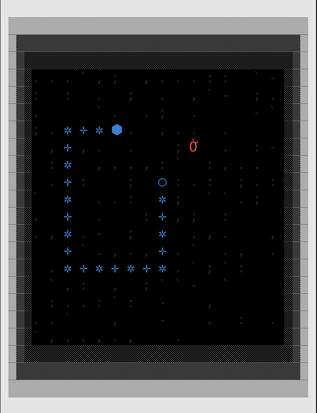
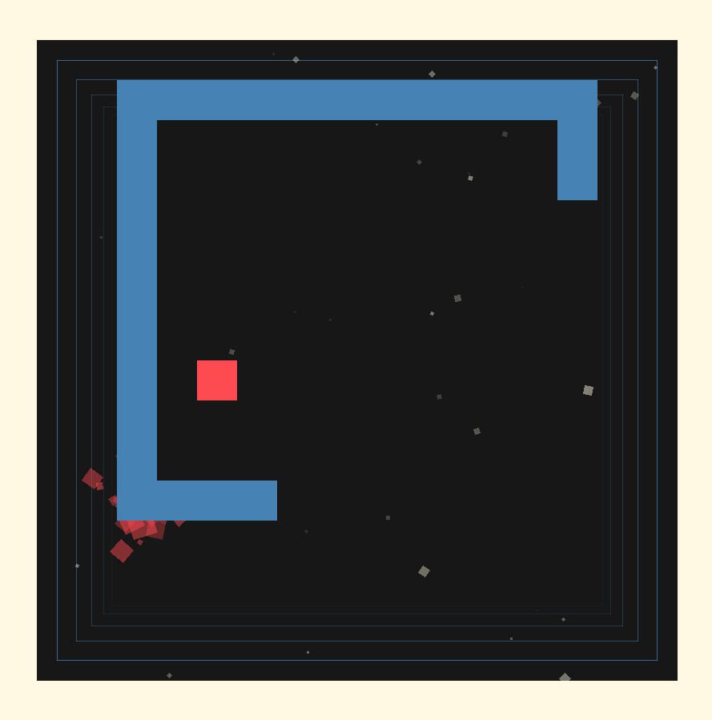
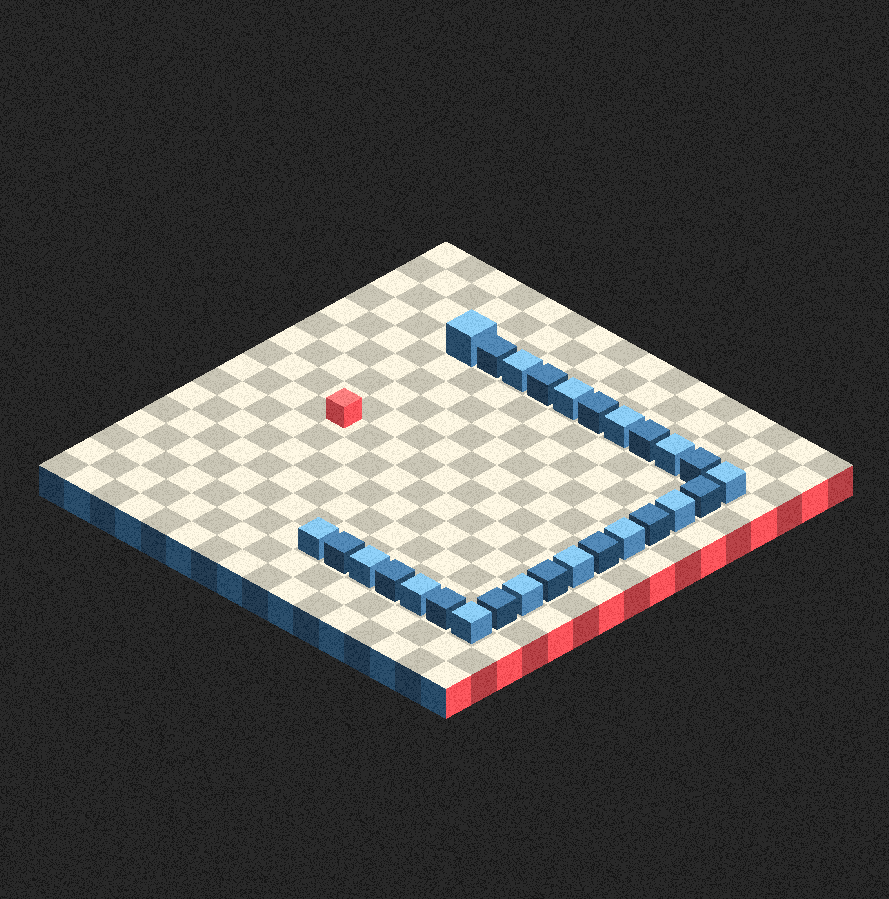

# <h1 align="center">NIBBLER</h1>

<p align="center">
   <b>A cross-platform Snake game reimagining with hot-swappable graphics libraries and zero-leak memory management. Exploring the boundaries between ASCII art, pixel graphics, and isometric 3D — all in a single executable.</b><br>
</p>

---

<p align="center">
    
    
    
    
</p>
<p align="center">
    
    
    
</p>

---

## Table of Contents
1. [In the Graphics Gardens of Eden](#in-the-graphics-gardens-of-eden)
2. [The Core Concept](#the-core-concept)
3. [Technical Architecture](#technical-architecture)
4. [Building & Running](#building--running)
5. [Current State](#current-state)
6. [What's Working](#donezo)
7. [What's Left](#donezont)
8. [Memory Management](#memory-management)
9. [Next Steps](#next-steps)
10. [Contributing](#contributing)

<br>

## In the Graphics Gardens of Eden

**Nibbler** is a Snake game multi-platform recreation. It features different realms of graphics rendering by hot-swapping libraries in real time, building a visual cross-realm trip from ASCII to isometric 3D representations of the same apple filled garden. The little, squiggly protagonist starts it's chomping mission in the launching terminal thanks to some `Ncurses` superpowers, and can cross whenever it wants (maybe whenever *some conditions are met* in the near future) to a 2D, `SDL2` kingdom of vectors and particles, after which a cube based landscape awaits as a final ascension step, deep down `Raylib`'s fields.

This is a **work-in-progress game** (soon to be finished) built in **C++20** as an exploration of:
- **Dynamic library loading**: hot-swappable graphics backends
- **Memory-safe architecture**: zero leaks across all three libraries
- **Game feel experimentation**: finding the sweet spot between responsive and deliberate
- **Visual aesthetics**: from dithered terminal art to isometric perspectives

<p align="center">
  
  
  
  <br>
  <i>Three gardens, one snake</i>
</p>

<br>

## The Core Concept

### Why Three Graphics Libraries?

I wanted to see how the same game logic could manifest across radically different visual presentations, first, and then make it a round trip by seeing how different visual presentations can affect back the shared game logic:

- **NCurses (Terminal)**: Dithered shadows, Unicode box-drawing borders, ground texture from ASCII punctuation. I've always loved terminal-based graphics and games, so starting here was an easy decision to make.

- **SDL2 (2D Pixel Art)**: Crisp sprites, smooth animations, classic pixel-perfect Snake aesthetics. I've been dabbling in clean, geometrical 2D graphics for a while, so taking the chance to experiment some more was also a logical step.

- **Raylib (Isometric 3D)**: Tilted perspective, depth-aware rendering, shadows and volume. Snake but make it cubic. 3D graphics are usually the place to go for me, as I'm a way better modeler than artist, so I'm quite versed in 3D pipelines (even to achieve 2D graphics, as seen in my [ditherer tools](https://github.com/hugomgris/sprite_ditherer), for example).

The technical challenge: **runtime library switching**. No restarts, no state loss, just seamless transitions between visual realms with the hit of a button. First as a first-hand feature, then as a gameplay and narrative tool.

### The Dynamic Library Architecture

Instead of compiling graphics code directly into the executable, Nibbler loads graphics libraries as **shared objects** (`.so` files) at runtime:

```
nibbler (executable)
  ↓ dlopen()
  ├── nibbler_ncurses.so  → NCurses renderer
  ├── nibbler_sdl.so      → SDL2 renderer
  └── nibbler_raylib.so   → Raylib renderer
```

When you press `1`, `2`, or `3`:
1. Current library is unloaded (`dlclose()`)
2. New library is loaded (`dlopen()`)
3. State is reinitialized
4. Game continues without blinking

This is the same technique used in **game engine plugins**, **browser extensions**, and **professional game development** (think Unreal Engine's hot-reload), just made by hand as a little game and graphics engine.

<br>

## Technical Architecture

### Project Structure

```
nibbler/
├── incs/                         # Header files
│   ├── IGraphic.hpp              # Graphics interface (all libs implement this)
│   ├── Snake.hpp                 # Snake game logic
│   ├── Food.hpp                  # Food spawning and rendering data
│   ├── GameManager.hpp           # Game state machine
│   ├── LibraryManager.hpp        # Dynamic library loader
│   └── ...
│
├── srcs/
│   ├── main.cpp                  # Game loop and state machine
│   ├── Snake.cpp
│   ├── Food.cpp
│   ├── GameManager.cpp
│   ├── LibraryManager.cpp
│   └── graphics/
│       ├── NCursesGraphic.cpp    # Terminal renderer (compiled to .so)
│       ├── SDLGraphic.cpp        # 2D renderer (compiled to .so)
│       └── RaylibGraphic.cpp     # 3D renderer (compiled to .so)
│
├── logos/                        # Art title screens across libraries
│   ├── ncurses_title_big.txt
│   ├── ncurses_gameover_big.txt
│   └── ...
│
├── checks/                       # Memory leak testing infrastructure
│   ├── check_leaks_unified.sh    # Primary Valgrind checker
│   ├── all_libs.supp             # Suppression file for library internals
│   └── ...
│
├── docs/                         # Development logs and documentation
│   ├── devlog_01.md              # Journey from concept to first playable
│   ├── devlog_10.md              # Latest: color management fixes
│   └── ...
│
├── Makefile                      # Build system
└── README.md
```

### The Interface Pattern

All three graphics libraries implement the same interface (`IGraphic.hpp`):

```cpp
class IGraphic {
public:
    virtual void init(int width, int height) = 0;
    virtual void render(const GameState& state, float deltaTime) = 0;
    virtual void renderMenu(const GameState& state) = 0;
    virtual void renderGameOver(const GameState& state) = 0;
    virtual Input pollInput() = 0;
    virtual ~IGraphic() = default;
};
```

This means the game logic (`main.cpp`) doesn't need to know *which* library is loaded. It just calls `render()` and the active library handles the rest.

### The State Machine

The game operates as a state machine with four states:

```
┌─────────┐  Enter   ┌─────────┐  Space   ┌─────────┐
│  Menu   │ ───────> │ Playing │ <──────> │ Paused  │
└─────────┘          └─────────┘          └─────────┘
                           │
                           │ Collision
                           ↓
                      ┌─────────┐  Enter   ┌─────────┐
                      │GameOver │ ───────> │  Menu   │
                      └─────────┘          └─────────┘
```

Each state has its own rendering logic and input handling. Library switching works in **any state** — you can travel between realms mid-game.

<br>

## Building & Running

### Prerequisites

- **C++20 compiler** (GCC 11+ or Clang 13+)
- **NCurses** (usually pre-installed on Linux/macOS)
- **SDL2** development libraries
- **Raylib** (source included in `libs/raylib/`)
- **Make**

### Linux/macOS Build

```bash
# Clone the repository
git clone https://github.com/jareste/nibbler.git
cd nibbler

# Build everything (executable + all three .so libraries)
make

# Run the game
./nibbler 30 30  # 30x30 game arena
```

> If you want a quick start, just run `make game` and a sample execution will be built and launched for you

The Makefile automatically:
1. Builds Raylib from source (if not already built)
2. Compiles NCurses library
3. Compiles SDL2 library
4. Links the main executable
5. Creates symbolic links for easy loading

### Build Flags

The project uses strict compilation flags to catch bugs early:

```makefile
CXXFLAGS = -Wall -Wextra -Werror -std=c++20 -fPIC -g3
```

- `-Wall -Wextra -Werror`: Treat all warnings as errors
- `-std=c++20`: Use C++20 features (especially for better move semantics)
- `-fPIC`: Position-independent code (required for shared libraries)
- `-g3`: Debug symbols for Valgrind

<br>

## Current State

### Development Timeline

This project has been **10 devlogs in the making**, tracking the evolution from "let's make Snake" to "let's make Snake switch realities":

- **Devlog 01-03**: Basic game loop, Snake logic, NCurses rendering
- **Devlog 04-06**: Dynamic library loading, SDL2 integration, Raylib 3D
- **Devlog 07-08**: Memory leak hunting (achieved **0 leaks**)
- **Devlog 09-11**: Menu systems, color management, visual polish
- **Devlog 12-current**: Gameplay expansion

<p align="center">
  
  <br>
  <i>Current menu state: ASCII art title with custom color palette</i>
</p>

The full devlogs are in `docs/` and chronicle every technical decision, bug fix, and "oh god why isn't this working, please end my suffering and let me be a goose farmer like that guy from linkedin" moment.

<br>

## Donezo

### Core Gameplay
- **Snake movement** with momentum-based feel
- **Food spawning** with collision detection
- **Score tracking**
- **Wall collision** and **self-collision** detection
- **Input buffering** (queue your next move before the current one finishes)
- **Pause system** (Space to freeze time)

### Graphics Switching
- **Runtime library loading** with `dlopen()` / `dlclose()`
- **Zero crashes** on library switches (extensive testing done)
- **State preservation** across switches (score, snake length, food position)
- **Press 1/2/3** to travel between realms mid-game

### NCurses Renderer (ASCII Realm)
- **Custom color palette** using `init_color()` for terminal emulators that support it
- **Dithered ground texture** with procedurally generated ASCII punctuation
- **Four-layer border** using Unicode box-drawing characters (░▒▓█)
- **Multi-line ASCII art titles** loaded from external files
- **Responsive layout** with small/large screen variants
- **Unicode snake sprites** (⬢ ✛ ✲ ○)

### SDL2 Renderer (2D Realm)
- **Pixel-perfect rendering** at native resolution
- **Double-buffered drawing** for tear-free animation
- **Color-coded sprites** (blue snake, red food)
- **Grid-based layout** with border rendering

### Raylib Renderer (3D Realm)
- **Isometric perspective** with configurable camera
- **Depth-aware rendering** (front-to-back sorting)
- **3D cube models** for snake and food
- **Ground plane** with tiled texture
- **Border walls** with actual 3D geometry

### Memory Management
- **Zero memory leaks** verified with Valgrind across all libraries
- **RAII patterns** throughout (destructors clean up properly)
- **Comprehensive suppression files** for library internals (`checks/all_libs.supp`)
- **Automated leak checking** with `check_leaks_unified.sh`

## Donezon't

### 🔧 Visual Polish (In Progress)

**Start Menu & Game Over Screens**
- [ ] Refine SDL2 menu graphics (currently placeholder text)
- [ ] Design Raylib 3D menu scene (maybe floating title?)
- [ ] Unify game over screen aesthetics across all three libraries
- [ ] Add animated transitions between menu and gameplay
- [ ] Animate the menus

**NCurses Specific**
- [x] ~~Fix color management for custom palettes~~ (**DONE**: removed `A_BOLD` flag interference)
- [ ] Optimize ASCII art loading (currently reads files every frame)
- [ ] Add small-screen game over title variant

**SDL2 Specific**
- [ ] Implement sprite sheets instead of colored rectangles
- [ ] Expand the visual effects and animations

**Raylib Specific**
- [ ] Experiment further with regards to postprocessing
- [ ] Implement camera interactivity
- [ ] Customize 3D models?

### 🔊 Audio Implementation (Not Started)

- [ ] **Sound effect system** (abstract interface like IGraphic)
- [ ] Bite sound on food collection
- [ ] Collision sound
- [ ] Menu navigation sounds
- [ ] Background music (optional, toggleable)
- [ ] Per-library audio backends? (OpenAL, SDL_mixer, Raylib audio)

> The challenge: Should audio be part of the graphics libraries, or a separate system? Leaning toward separate `IAudio` interface.

### Gameplay Experimentation (Planned)

- [ ] **Power-ups**: Speed boost, invincibility, reverse controls
- [ ] **Obstacles**: Randomly spawning walls that disappear after N seconds
- [ ] **Multiple foods**: Different colors, different score values
- [ ] **Difficulty scaling**: Increase speed as score grows
- [ ] **Multiplayer?**: Two snakes, one screen
- [ ] **Custom arenas?**: different game landscapes, maybe even tied to some obscure story (cazy, dreamy mode: on)

> Time is the biggest constrain here, as every new implementation needs to be done (and tested) across all platforms

<br>

## Memory Management

One of the core goals of this project was **zero-leak memory management** across three complex graphics libraries. This was harder than expected.

### The Challenge

External libraries (SDL2, NCurses, Raylib) allocate memory internally for:
- **Video drivers** (X11, Wayland, DRM)
- **OpenGL contexts** and shader compilation
- **Font rendering** (FreeType, Fontconfig)
- **Audio backends** (ALSA, PulseAudio)

Valgrind sees these as "definitely lost" because they're not freed in user code. But they're not *my* leaks — they're library internals.

### The Solution: Suppression Files

The `checks/` directory contains Valgrind suppression files that filter out library internals:

```bash
# Run the unified leak checker
./checks/check_leaks_unified.sh

# Output:
# ✅ No leaks detected in your code!
# definitely lost: 0 bytes in 0 blocks
# indirectly lost: 0 bytes in 0 blocks
# Suppressed: 717,342 bytes (library internals)
```

The suppression file (`all_libs.supp`) tells Valgrind:
- Ignore SDL2's X11 driver allocations
- Ignore Raylib's GLFW/OpenGL context
- Ignore NCurses's color initialization
- Ignore system library leaks (glibc, LLVM)

**Result**: Clean bill of health for all user code.

For more details, see `checks/LEAK_CHECKING.md`.

<br>

## Next Steps

The immediate roadmap:

1. **Finish menu screens** across all libraries (priority: SDL2 and Raylib)
2. **Implement audio system** (research `IAudio` interface design)
3. **Gameplay experiments** (power-ups, obstacles, difficulty scaling)
4. **Config file system** (JSON for game settings)
5. **Sprite sheets for SDL2** (replace colored rectangles with actual art)

Long-term dreams:
- **Level editor** with custom arenas
- **Multiplayer** over network (ambitious)
- **Story mode?** in one of the devlogs I left behind a list of ideas regarding what a recreation of snake could be in my mind. Pursuing some of those would be nice.
- **Mobile port?** (Raylib supports Android/iOS)

<br>

---

## Contributing

This is a personal learning project, but if you're inspired by the architecture or want to suggest improvements:

- **Open an issue** for bugs or feature ideas
- **Fork and experiment** — the codebase is designed to be hackable
- **Share your own dynamic library projects** — I'd love to see them!

<br>

---

> *Built with C++, three graphics libraries, Valgrind, and tears, and blod, and hopes, and dreams*

