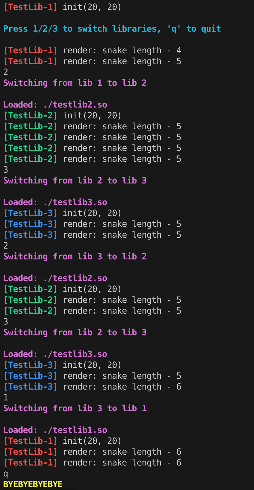

# Nibbler - Devlog - 2

## Table of Contents
1. [Day Two Plan](#21---day-two-plan)
2. [Runtime Switching](#22---runtime-switching)
    - [Splitting the `testlib`](#221---splitting-the-testlib)
    - [Expanding `Main`](#222---expanding-main)
3. [Transitioning to Real Graphic Library Interfacing](#23-transitioning-to-real-graphic-library-interfacing)
    - [Makefile Modifications](#231---makefile-modifications)
        - [Some Notes Regarding Flags](#some-notes-regarding-flags)
        - [Build Flow](#build-flow)
        - [Expected Output](#expected-output)
    - [Setting Up Boilerplates](#232---setting-up-boilerplates)
        - [Ncurses Boilerplate](#ncurses-boilerplate)
        - [SDL2 Boilerplate](#sdl2-boilerplate)
        - [Raylib Boilerplate](#raylib-boilerplate)
4. [Final Considerations for Today](#24---final-considerations-for-the-day)

<br>
<br>
<br>

# 2.1 - Day Two Plan
With the basic architecture in place, thanks to which the nibbler executable can load and manage `.so` files at runtime, the main objectives for this second development day are:
- Implement and test **runtime library switching**
- Set up the build pipelines (through Makefile) to fetch the chosen graphic libraries and clone the necessary files for a fresh compilation
- Move from dummy testlibs to basic implementations of the three chosen libraries

**Runtime Switching** will be the toughest step, I feel, as it will definately require a jump in complexity regarding the current basic build. The reward will be, though, equally substantial, as after achieving this step there will trully be a fairly robust build for what nibbler asks, and from that point on the main focus will be able to turn to game design and graphics development. **Makefile stuff **will be quite straightforward: check if the required files are in the repository (won't in a fresh compilation case), fetch and clone them, make the `.so` file build go through them and link the project's dynamic libraries against the graphic libraries, compile the binary. The last step on this Day Two,** moving to basic implementations of the chosen libraries** should also be simple, although I guess it will depend on each library; we'll see down the line (down the documet).

<br>
<br>
<br>

# 2.2 - Runtime Switching
To achieve testing capabilities for runtime switching, the following steps must be taken:
- Split the `testlib` into three different dummies
- Slightly tweak each testlib so the log-based testing is can be easily read and checked.
- Rewrite `Main` so that it both has the necessary tools for Runtime Switching and a basic, finite loop for the testing


## 2.2.1 - Splitting the `testlib`
Moving from a single testlib into three replicas is just a matter of doubling the code, numbering the class names and logs and color coding their respective outputs to make the console checks easier. The following code will be replicated with suffixes `2` and `3`, and color output will go through the newly added header `colors.h`:
```cpp
#include "../../incs/IGraphic.hpp"
#include "../../incs/colors.h"
#include <iostream>

class TestLib1 : public IGraphic {
	public:
		void init(int width, int height) override {
			std::cout << BRED << "[TestLib-1]" << RESET <<  " init(" << width << ", " << height << ")" << std::endl;
		}

		void render(const GameState &state) override {
			std::cout << BRED << "[TestLib-1]" << RESET << " render: snake length - "
				<< state.snake.length << std::endl;
			
				if (state.gameOver)
					std::cout  << BRED << "[TestLib-1]" << RESET << " GAME OVER" << std::endl;
		}

		Input pollInput()  override{
			// This should be nonblocking, but for testing purposes it's ok like this
			return Input::None;
		}
};

extern "C" IGraphic *createGraphic() {
	return new TestLib1();
}

extern "C" void destroyGraphic(IGraphic *g) {
	delete g;
}
```
## 2.2.2 - Expanding `Main`
In order to achieve the objective as quickly as possible, let's just rebuild `Main` so that *it works* regarding Runtime Switching, and we'll refactor later down the line. The new `Main` is larger, but not that complicated. It just needs:
- Input handling (via `termios`)
- A `GraphicLibrary` class wrapper around the previous `Main` code that implements methods to **load and unload libraries**.
- A finite game loop that runs for a set number of "frames", catches user input, simulates some logic and repeats itself after a fixed amount of time.

```cpp
#include "../incs/IGraphic.hpp"
#include "../incs/GameState.hpp"
#include "../incs/colors.h"
#include <dlfcn.h> // for dynamic linking
#include <unistd.h> // for usleep - TESTING
#include <termios.h> // for non-blocking input
#include <fcntl.h>
#include <iostream>

char	getNonBlockingChar() {
	struct termios oldt, newt;
	char ch = 0;

	tcgetattr(STDIN_FILENO, &oldt);
	newt = oldt;
	newt.c_lflag &= ~(ICANON | ECHO);
	tcsetattr(STDIN_FILENO, TCSANOW, &newt);

	int oldf = fcntl(STDIN_FILENO, F_GETFL, 0);
	fcntl(STDIN_FILENO, F_SETFL, oldf | O_NONBLOCK);

	ch = getchar();

	tcsetattr(STDIN_FILENO, TCSANOW, &oldt);
	fcntl(STDIN_FILENO, F_SETFL, oldf);

	return ch;
}

// TODO: if this class survives beyond the initial testing phase, it should be in CANONICAL FORM
class GraphicLibrary {
	private:
		void *handle;
		IGraphic *graphic;
		using CreateFn = IGraphic *(*)();
		using DestroyFn = void (*)(IGraphic*);
	
	public:
		GraphicLibrary() : handle(nullptr), graphic(nullptr) {}

		bool load(const char* libPath) {
			handle = dlopen(libPath, RTLD_NOW);
			if (!handle) {
				std::cerr << "dlopen error: " << dlerror() << std::endl;
				return false;
			}
			
			CreateFn create = (CreateFn)dlsym(handle, "createGraphic");
			DestroyFn destroy = (DestroyFn)dlsym(handle, "destroyGraphic");
			
			if (!create || !destroy) {
				std::cerr << "Symbol error: " << dlerror() << std::endl;
				dlclose(handle);
				handle = nullptr;
				return false;
			}
			
			graphic = create();
			std::cout << "Loaded: " << libPath << std::endl;
			return true;
		}

		void unload() {
			if (graphic) {
				using DestroyFn = void (*)(IGraphic*);
				DestroyFn destroy = (DestroyFn)dlsym(handle, "destroyGraphic");
				if (destroy) {
					destroy(graphic);
				}
				graphic = nullptr;
			}

			if (handle) {
				dlclose(handle);
				handle = nullptr;
			}
		}

		IGraphic *get() { return graphic; }
		~GraphicLibrary () { unload(); }
};

int main() {
	const char *libs[] = {
		"./testlib1.so",
		"./testlib2.so",
		"./testlib3.so"
	};
	int currentLib = 0;

	GraphicLibrary gfxLib;
	if (!gfxLib.load(libs[currentLib]))
		return 1;

	gfxLib.get()->init(20, 20);

	Vec2 segments[4] = {{10,10}, {9,10}, {8,10}, {7,10}};
    SnakeView snake { segments, 4 };
    FoodView food{ {5,5} };
    GameState state { 20, 20, snake, food, false };

	std::cout << BCYN << "\nPress 1/2/3 to switch libraries, 'q' to quit\n" << RESET << std::endl;

	// TESTING GAME LOOP
	for (int frame = 0; frame < 1000; ++frame) {
		char key = getNonBlockingChar();

		if (key == 'q') {
			std::cout << BYEL << "\nBYEBYEBYEBYE" << RESET << std::endl;
			break;
		}

		if (key >= '1' && key <= '3') {
			int newLib = key - '1';
			if (newLib != currentLib) {
				std::cout << BMAG << "\nSwitching from lib " << (currentLib + 1) << " to lib " << (newLib + 1) << std::endl << std::endl;

				// 1- Destroy the current graphic
				gfxLib.unload();

				// 2- Make the actual switch
				if (!gfxLib.load(libs[newLib])) {
					std::cerr << BRED << "Failed to load new library!" << RESET << std::endl;
					return 1;
				}

				gfxLib.get()->init(20, 20);
				currentLib = newLib;
			}
		}

		// Re-render
		gfxLib.get()->render(state);

		// Game logic simulation
		if (frame % 10 == 0 && snake.length < 10) {
			snake.length++;
			state.snake = snake;
		}
		
		// 0.5 s delay
		usleep(500000);
	}

	return 0;
}
```

This new main achieves exactly what it aimed to: every half a second, a `testlib` log is printed to the console, tagged with the number and color respective to the current library. Pressing `1/2/3` keys switches the library (with switch and load logs), and every 10 frames the snake grows one unit. Pressing `q` key exits the execution with a farewell message. It looks like this:



Now, let's break down some of the new stuff added to `Main`:
- The `input polling` in this test is done via `termios.h`, but the polling itself will be delegated to each implemented library's own event polling. Said polling will undergo a translation from library-specific inputs to the `Input` enum, returning special values for library swithching (e.x., `Input::SwitchLib1`). Nevertheless, as I'm not that familiar with `termios.h`, let's examine how to use it for simple non-blocking input polling:
    - `termios` is the Linux/Unix **terminal I/O** control system. In other words, is the system's tool to process keyboard input while in terminal. I guess the name is quite self-explanatory: TERMinal InputOutput Stream.
    - Normally / By default, terminal input is:
        - **Canonical Mode**: Waits for Enter key, bufers the whole line
        - **Echoing**: Shows what you type on screen
        - **Blocking**: `getchar()` pauses program until you type something
    - But the testing needs:
        - **Non-canonical mode**: Read each keypress immediately
        - **No echo**: Don't show what's typed
        - **Non-blocking**: Don't pause execution if no key is pressed
    - To achieve this, the following bits are put in place:
        -`struct termios odlt, newt` → Terminal setting structures
        -`tcgetattr` → Stores file descriptor for standard input and original terminal settings
        - `newt.c_lflag &- ~(ICANNON | ECHO)` → Turn OFF canoncail mode and echo:
            - `c_lflag` = "local flags" (terminal behavior flags)
            - `ICANNON` = cannonical mode (line buffering)
            - `ECHO` = echo typed characters
            - `~(...)` = bitwise NOT (turns flags OFF)
            - `&=` = bitwise AND assignment
        - `tcsetattr(STDIN_FILENO, TCSANOW, &new)` → Apply new settings immediately (TCSANOW means, well, **NOW**).
        - `int oldf = fcntl(STDIN_FILENO, F_GETFL, 0)` → Get current file status flags
        - `fcntl(STDIN_FILENO, F_SETFL, oldf | O_NONBLOCK)` → Add `O_NONBLOCK` flag (don't wait for input, return immediately)

<br>

- Library switching goes through this detailed flow:
    - Unload the current library
        - Destroy the current displayed graphic (delete windows, free SDL resources, etc.)
        - Unload the `.so` from memory
    - Load new library
        - Load new `.so`
        - Create new `IGraphic` object (new SDL window, SFML window, ncruses screen, etc.)
    - Reinitialize
        - Call `init()` on the new library with initially set up dimensions (program run arguments)
        - Draw next frame with the new library while preserving Game State.

> In the future, when real libraries are implemented, **a pause during switch might be needed** to prevent the snake from moving while the screen is rebuilding.

> Question to self: **Will the switching be visually translated in some kind of screen flashing or hiccup?** If so, I'll need to research how to avoid it, if possible at all.

<br>
<br>
<br>

## 2.3. Transitioning to Real Graphic Library Interfacing
First of all, the transition calls for a revision of the **High-Level Architecture** scheme. The current structure in mind is:
```
nibbler/
├── libs/
│   ├── SDL2/           # Cloned/built SDL2
│   ├── SFML/           # Cloned/built SFML
│   └── ncurses/        # System ncurses (usually pre-installed)
├── srcs/
│   ├── graphics/
│   │   ├── SDLGraphic.cpp      # SDL2 implementation
│   │   ├── SFMLGraphic.cpp     # SFML implementation
│   │   └── NCursesGraphic.cpp  # ncurses implementation
│   └── main.cpp
├── nibbler_sdl.so      # Built from SDLGraphic.cpp
├── nibbler_sfml.so     # Built from SFMLGraphic.cpp
└── nibbler_ncurses.so  # Built from NCursesGraphic.cpp
```
Let's also restate the choice of libraries, their types and paradigms:
| Library | Type | Paradigm |
| ------- | ---- | -------- |
| Ncurses | Terminal | Text-based |
| SDL2    | Low-Level | Event-driven |
| Raylib  | Game-engine | Frame-based loop  | 

And let's plan our steps:
1. Makefile modifications to handle library fetching in a fresh compilation **(Remember: no graphic library resources should be commited!!)**
2. Write boilerplate Cpp files for each binding `.so` file, related to each chosen graphic library
    1. Implement the set up interfaces
    2. Write a basic rendering entry point
3. Adjust `Main` as needed to finish the transition

### 2.3.1 - Makefile modifications
I once again find myself in a familiar place, that deep well with a big sign in front that reads "I thought this would be easy". Because this was a pain. **The Makefile neded significant restructuring** for it to be able to handle:
1. **Automatic fetching and building of external libraries** (SDL2 and Raylib; Ncurses is system-installed)
2. **Compilation of three separate shared libraries** (3 `.so` files)
3. **Proper linking against external library dependencies**
4. **Dependency tracking** for both main program (executable) and library sources

#### Overall New Structure
The Day Two version of the Makefile follws this organizational pattern:
```makefile
# 1. Color definitions (for output formatting)
# 2. Binary and library names
# 3. Directory structure
# 4. Main program files
# 5. Compiler flags
# 6. External library configuration
# 7. Graphic library source files
# 8. Library-specific compiler and linker flags
# 9. Build targets and rules
# 10. Cleanup targets
```

I struggled a little bit during the recomposition due to the need to juggle a handful of directories, rules and library sources, finding myself a couple of times facing make errors regarding what was being detected as a rule, as a directory or as target file. Taking into consideration that Makefile is not my strong suit and that the three-library build imposed a necessary attention to detail regarding how every one of them needed to be compiled, this ended up being a flag fest. I guess that seen from a distance is not that big of a deal, in the end this is a small project, but when I saw the building confirmation after runing `make` I almost shed a tear.

#### Some notes regarding flags
```
**Compiler Flags:**
```makefile
CC              := c++
CFLAGS          := -Wall -Wextra -Werror -std=c++20 -g $(INCLUDES)
LIB_CFLAGS      := -Wall -Wextra -Werror -std=c++20 -g -fPIC $(INCLUDES)
DEPFLAGS        := -MMD -MP
LDFLAGS         := -ldl

# Library-specific flags
SDL_CFLAGS      := $(LIB_CFLAGS) -I$(SDL_DIR)/include
RAYLIB_CFLAGS   := $(LIB_CFLAGS) -I$(RAYLIB_DIR)/src
NCURSES_CFLAGS  := $(LIB_CFLAGS)

# Linker flags for each library
SDL_LDFLAGS     := -L$(SDL_DIR)/build -lSDL2-2.0 -Wl,-rpath,$(SDL_DIR)/build
RAYLIB_LDFLAGS  := -L$(RAYLIB_DIR)/src -lraylib -lm -lpthread -ldl -lrt -lX11
NCURSES_LDFLAGS := -lncurses
```

- `-fPIC`: **Position Independent Code** - required for shared libraries (`.so` files)
- `-shared`: Creates a shared library instead of an executable
- `-ldl`: Links against `libdl.so` (dynamic linking library) - needed for `dlopen()`, `dlsym()`, `dlclose()`
- `-Wl,-rpath,$(SDL_DIR)/build`: Sets runtime library search path so the `.so` can find SDL2's shared library

Besides this, the building pipeline now checks if the source code of the needed libraries is inside the project directory (`Raylib` and `SDL2`, as `Ncurses` doesn't need any preparation). In a regular, fresh `clone→build→run` attempt, the files won't be there (that would be fatal according to the task's subject), so the files will be downloaded from their main repositories
```makefile
SDL_REPO        := https://github.com/libsdl-org/SDL.git
RAYLIB_REPO     := https://github.com/raysan5/raylib.git
```
```makefile
check_libs:
ifndef SDL_EXISTS
    @echo "SDL2 not found. Cloning..."
    @mkdir -p $(LIB_DIR)
    @git clone --depth 1 --branch release-2.28.x $(SDL_REPO) $(SDL_DIR)
    @cd $(SDL_DIR) && mkdir -p build && cd build && cmake .. && make -j4
    @echo "SDL2 built successfully"
endif
ifndef RAYLIB_EXISTS
    @echo "Raylib not found. Cloning..."
    @mkdir -p $(LIB_DIR)
    @git clone --depth 1 $(RAYLIB_REPO) $(RAYLIB_DIR)
    @cd $(RAYLIB_DIR)/src && make -j4
    @echo "Raylib built successfully"
endif
    @echo "All libraries ready"
```
The specific flow here is:
1. `$(wildcard ...)` checks if a sentinel file exists in each library directory
2. If the file doesn't exist, the library is cloned from Github
3. SDL2 is built usinc `CMake`, Raylib using its own `Makefile`
4. `--depth 1` clones only the latest commit (for optimization purposes)
5. `-j4` enables parallel compilation with 4 threads

The rest of the Makefile is suffiently straight forward. Each of its rules:
1. Creates the necessary directories
2. Compiles with library-specific include paths (`SDL_CFLAGS`, etc.)
3. Uses `-c` to compile without linking
4. Generates dependency file (`.d`) with `-MMD -MP` and `-MF`

#### Build Flow
1. **check_libs** runs first
    - Checks for SDL2 and Raylib
    - Clones and builds if missing
2. **directories** creates needed folders
    - [`.obj/`](.obj/ ), [`.obj/libs/`](.obj/libs/ ), [`.dep/`](.dep/ ), [`.dep/libs/`](.dep/libs/ )
3. **Three `.so` files** are built
    - Each compiles its [`srcs/graphics/*cpp](srcs/graphics/) file
    - Links against its external library
    - Produces a shared library
4. **Main binary** is built
    -Compiles [`srcs/main.cpp`](srcs/main.cpp)
    - Links with `-ldl` for dynamic loading
    - Can now `dlopen()` the `.so` files at runtime

#### Expected output:
- SDL2 and Raylib are cloned and built (first run only)
- Three `.so` files are created
- Main binary is created
- Program runs and can switch between libraries with keys 1/2/3

>The complete build on a fresh clone takes ~2-3 minutes due to compiling SDL2 and Raylib, but subsequent builds are instant (only recompiles changed files).

### 2.3.2 - Setting Up Boilerplates
With access to the graphic library APIs achieved through the `.so` files, it is time to switch from `testlib`, log-based render calls to real draw calls. **The main goal at this point is achieving three different working renders** while maintining the run-time, `1/2/3` keys based switching (i.e., without breaking everything). On paper (**looks nervously back at the well*) this shouldn't be too complicated, as the process is the same as the `testlib` ones, i.e. a handful of `overrides` targetting `IGraphic` in a single `cpp` file for each library: `init()`, `render()`, `pollInput()` and the necesary `extern "C"` symbol setup. 

> Given that all of this is done through inheriting classes, my understanding is that the subject requires these to be in Orthodox Canonical Form, so we'll have that in mind.

### Ncurses Boilerplate
Given that this is the most basic of the chosen libraries, let's start here. Ncurses is a console based graphic library useful to draw stuff directly in the same console from which the program is run. This means that the target render is **char based**, and that both the **behavior and the functions of the console need to be seized by the rendering process**.

Because this is all new territory for me, I'll go override by override listing the implementations and breaking down their components.

```cpp
void init(int w, int h) override {
        width = w;
        height = h;
        
        initscr();              // Initialize ncurses
        cbreak();               // Disable line buffering
        noecho();               // Don't echo input
        keypad(stdscr, TRUE);   // Enable arrow keys
        nodelay(stdscr, TRUE);  // Non-blocking input
        curs_set(0);            // Hide cursor
        
        start_color();
        init_pair(1, COLOR_GREEN, COLOR_BLACK);  // Snake
        init_pair(2, COLOR_RED, COLOR_BLACK);    // Food
        
        std::cout << BBLU << "[NCurses] Initialized: " << width << "x" << height << RESET << std::endl;
    }
```

- `Initscr()` → Ncurses initialization entry point
    - Initializes the library and terminal screen
    - Queries terminal capabilities
    - Allocates memory for screen buffer
    - Creates `stdscr` (standard screen window)
    - Saves current terminal state
    - **Returns** a Pointer to `stdscr`, the main window.
- `cbreak()` → Disabling of line buffering
    - Makes character available immediately, without the need to press Enter
    - Gets rid of the `\n` char waiting before sending input, so that each keypress is immediately available to `getch()`
- `noecho()` → Don't echo input
    - Typed characters won't appear on screen, as they would break the rendering (we want the snake, no the keys!)
- `keypad(strdscr, TRUE)` → Enable arrow keys
    - Enables special keys (arrow keys, function keys, ...)
    - `TRUE` → Enables Keypad Mode. Needed to translate escape sequences into constants (like `\033[A` → `KEY_UP`)
- `nodelay(stdscr, TRUE)` → Non Blocking Input
    - Makes it so `getch()` returns immediately if no key is pressed
    - `TRUE` → Non-Blocking Mode
    - **Returns** `ERR`(-1) if no key available
- `curs_set(0)` → Hide cursor
    - Makes the terminal cursor invisible (0), as we want to completely seize the visuals of the terminal
- `start_color() `→ Initializes color support
    - Checks if terminal supports colors
    - Must be called before using any color functions
    - **Returns** `OK` on success, `ERR` if colors are not supported
- `init_pair(1, COLOR_GREEN, COLOR_BLACK)` → Creates color pairs (foreground + background combinations)
    - `1` -> index of pair (1-255)
    - First color = foreground
    - Second color = background

```cpp
void render(const GameState& state) override {
        clear();
        
        // Draw border
        box(stdscr, 0, 0);
        
        // Draw snake
        attron(COLOR_PAIR(1));
        for (size_t i = 0; i < state.snake.length; ++i) {
            mvaddch(
                state.snake.segments[i].y + 1,
                state.snake.segments[i].x + 1,
                'O'
            );
        }
        attroff(COLOR_PAIR(1));
        
        // Draw food
        attron(COLOR_PAIR(2));
        mvaddch(state.food.position.y + 1, state.food.position.x + 1, '*');
        attroff(COLOR_PAIR(2));
        
        refresh();
    }
```
- `clear()` → Clears the entire screen buffer
    - Fills `stdscr` with spaces
    - Changes are in memory only until `refresh()` is called
- `box(stdscr, 0, 0)` → Draws a border around the window
    - `0` `0` → use default vertical and horizontal characters (`|` for vertical, `-` for horizontal, `+` for corners)
- `attron(COLOR_PAIR(1))` → Turns on attributes for subsequent drawing
    - Atribute → pre-set color pair
    - It's paired against `attroff`
    - Useful attributes: `A_BOLD`, `A_UNDERLINE`, `A_REVERSE`, `A_BLINK`
        - Combination example → `attron(COLOR_PAIR(1) | A_BOLD)`
- `mvaddch(y, x, 'O')` → `M`o`v`e cursor and `add` a `ch`aracter
    - Arguments: y and x values, for the sent character ('O')
    - Vales have a `+1` offset to account for the border
- `refresh()` → Updates the physical screen with bufffer contents
    - Double buffering: all drawing functions write to memory buffer, `refresh()` copies buffer to terminal in one operation.
    - Prevents flickering and is optimized to only redraw changed characters

```cpp
Input pollInput() override {
        int ch = getch();
        switch (ch) {
            case KEY_UP:    return Input::Up;
            case KEY_DOWN:  return Input::Down;
            case KEY_LEFT:  return Input::Left;
            case KEY_RIGHT: return Input::Right;
            case 'q':       return Input::Quit;
            case '1':       return Input::SwitchLib1;
            case '2':       return Input::SwitchLib2;
            case '3':       return Input::SwitchLib3;
            default:        return Input::None;
        }
    }
```
- `getch()` → Gets one character from input
    - **Returns:**
        - Key code for special keys (`KEY_UP`, `KEY_DOWN`, etc.)
        - ASCII value for normal keys(`'q'`, `'1`', etc.)
        - `ERR` if no input available (because `nodelay` is on)
    - Normally blocking, but because `nodealy` is `TRUE`, it's non-blocking

```cpp
~NCursesGraphic() {
		endwin();
		std::cout << BBLU << "[NCurses] Destroyed" << RESET << std::endl;
	}
```
- `endwin()` → Shuts down Ncurses and restores terminal
    - Restores original terminal settings
    - Deallocates screen buffers
    - Moves cursor to bottom of screen
    - Re-enables echo, line buffering, etc.
    - **MUST** always be called before program exist, as if forgotten the terminal will be broken

<br>

### SDL2 Boilerplate
Boilerplating a simple, plain color base render window in SDL2 is, once again, a pretty straight forward endeavor. The main difference with Ncurses is that a graphic window needs to be created, initialized, managed and destroyed (the same will be tru for `Raylib`). Other than that, this is just a matter of researching the documentation and available basic examples to find the necessary functions to call in order to achieve the visualization of our proto snake.

```cpp
void init(int width, int height) override {
    if (SDL_Init(SDL_INIT_VIDEO) < 0) {
        std::cerr << "SDL init error: " << SDL_GetError() << std::endl;
        return;
    }
    
    window = SDL_CreateWindow(
        "Nibbler - SDL2",
        SDL_WINDOWPOS_CENTERED,
        SDL_WINDOWPOS_CENTERED,
        width * cellSize,
        height * cellSize,
        SDL_WINDOW_SHOWN
    );
    
    renderer = SDL_CreateRenderer(window, -1, SDL_RENDERER_ACCELERATED);
    std::cout << BRED << "[SDL2] Initialized: " << width << "x" << height << RESET << std::endl;
}
```
- `SDL_INIT(SDL_INIT_VIDEO) < 0` → Initializes the SDL library subsystems
    - `SDL_INIT_VIDEO` → Flag to initialize video/graphics subsystems only
        - Other possibilities: `SDL_INIT_AUDIO`, `SDL_INIT_TIMER`, `SDL_INIT_JOYSTICK`, `SDL_INIT_EVERYTHING`
    - **Returns** `0` on success, `negative value` on failure
    - Must call before sing any SDL functions
        - Queries video drivers available in the system
        - Allocates internal SDL structures
        - Sets up platform-specific graphics context
- `SDL_GetError()` → Returns the last error message as a `C-string`
    - Returns a human-readable error description
    - Thread safe
    - Auto-clears after being called
- `SDL_CreateWindow()` → Creates the SDL window to which renders will be drawn
    - First parameter is a string with the window title
    - `SDL_WINDOWPOS_CENTERED` → Centers the window horizontally (first appearance) and vertically (second appearance) on screen (can also use specific coords)
    - `width * cellsize` / `height * cellsize` → Sets up the grid dimensions based on pre-set cell size (in pixels)
    - `SDL_WINDOW_SHOWN` → Window flags (can be combined with `|`)
        - Other possibilities: `SDL_WINDOW_FULLSCREEN`, `SDL_WINDOW_RESIZABLE`, `SDL_WINDOW_BORDERLESS`, `SDL_WINDOW_HIDDEN`, `SDL_WINDOW_OPENGL`, `SDL_WINDOW_VULKAN`
    - **Returns** Pointer to `SDL_Window` on success, `nullptr` on failure
    - Creates an Operating System Window, a Window Surface (drawing area) and a Window Context (for rendering)
- `SDL_CreateRenderer(window, -1, SDL_RENDERER_ACCELERATED)` → Creates a 2D rendering conext for the window
    - `window` → Target of render
    - `-1` = First driver supporting requested flags (0,1,2,... target specfic driver indices)
    - `SDL_RENDER_ACCELERATED` → Use `GPU` hardware acceleration
        - Others: `SDL_RENDERER_SOFTWARE`, `SDL_RENDERER_PRESENTVSYNC`, `SDL_RENDERER_TARGETTEXTURE`
    - **Returns** pointer to `SDL_Renderer` on success, `nullptr` on failure
    - This is needed because **SDL2 uses a render/present model (like double buffering).
        - Calls draw to the renderer (in memory)
        - Then the drawing is presented to the window (visible on screen)
        - Much faster than drawing directly to window

```cpp
void render(const GameState& state) override {
    // Clear screen (black background)
    SDL_SetRenderDrawColor(renderer, 0, 0, 0, 255);
    SDL_RenderClear(renderer);
    
    // Draw snake (green)
    SDL_SetRenderDrawColor(renderer, 0, 255, 0, 255);
    for (size_t i = 0; i < state.snake.length; ++i) {
        SDL_Rect rect = {
            state.snake.segments[i].x * cellSize,
            state.snake.segments[i].y * cellSize,
            cellSize,
            cellSize
        };
        SDL_RenderFillRect(renderer, &rect);
    }
    
    // Draw food (red)
    SDL_SetRenderDrawColor(renderer, 255, 0, 0, 255);
    SDL_Rect foodRect = {
        state.food.position.x * cellSize,
        state.food.position.y * cellSize,
        cellSize,
        cellSize
    };
    SDL_RenderFillRect(renderer, &foodRect);
    
    SDL_RenderPresent(renderer);
}
```
- `SDL_SetRenderDrawColor(renderer, 0, 0, 0, 255)` → Sets the color for subsequent drawing operations
    - Takes a target renderer as first argument
    - Next arguments are `RED`, `GREEN`, `BLACK` and `ALPHA` components
    - Affects these functions: `SDL_RenderClear()`, `SDL_RenderDrawLine()`, `SDL_RenderDrawRect()`, `SDL_RenderFillRect()`
- `SDL_RenderClear(renderer)` → Clears the entire rendering target with the draw color
    - Prevents ghosting / lingering frames and is essential for animation
    - **Must** be called before drawing each frame
    - Changes are in memory buffer until `SDL_renderPresent()` is called
- `SDL_Rect` → Builds a structure representing a rectangle, with `Top-left corner coordinates(X-Y)`, `widht`, and `height`
    - Note: coordinate growth is leftwards for X, downwards for Y (this latter, unlike math coords)
    - Note: values are multiplied by `cellSize` because **Game logic uses grid coordinates** and **Graphics use pixel coordinates**
- `SDL_RenderFillRect()` → Fills a rectangle with the current draw color
    - Similar functions: `SDL_RenderDrawRect()` (outline only), `SDL_RenderDrawRects()` (Draw multiple outlines), `SDL-RenderFillRects` (fill multiple rectangles at once)
- `SDL_RenderPresent()` → Updates the screen with any rendering since previous call
    - All drawing goes to back buffer (renderer)
    - `SDL_RenderPresent()` swaps buffers
    - Back buffer becomes visible
    - Prevents flickering and tearing
    - **Called once per frame**, after drawing is complete. **NOT after each individual draw call** (inneficient)
    - `VSync` considerations:
        - If `SDL_RENDERER_PRESENTVSYNC` flag was used, this waits for monitor refresh
        - Prevents screen tearing
        - Caps framerate to monitor refresh rate (usually 60 FPS)

```cpp
Input pollInput() override {
    SDL_Event event;
    while (SDL_PollEvent(&event)) {
        if (event.type == SDL_QUIT)
            return Input::Quit;
        
        if (event.type == SDL_KEYDOWN) {
            switch (event.key.keysym.sym) {
                case SDLK_UP:    return Input::Up;
                case SDLK_DOWN:  return Input::Down;
                case SDLK_LEFT:  return Input::Left;
                case SDLK_RIGHT: return Input::Right;
                case SDLK_q:     return Input::Quit;
                case SDLK_1:     return Input::SwitchLib1;
                case SDLK_2:     return Input::SwitchLib2;
                case SDLK_3:     return Input::SwitchLib3;
            }
        }
    }
    return Input::None;
}
```
- `SDL_Event` → A union containing al lpossible event data
    - Simplified Structure:
        ```cpp
        typedef union SDL_Event {
            Uint32 type;              // Event type (SDL_QUIT, SDL_KEYDOWN, etc.)
            SDL_KeyboardEvent key;    // Keyboard event data
            SDL_MouseMotionEvent motion;
            SDL_WindowEvent window;
            // ... many other event types
        } SDL_Event;
        ```
    - Union saves memory beause only one type exists at a time
- `SDL_PollEvent()` → Checks the event queue and retrieves next event
    - **Returns** `1` if an event was retrieved, `0` if no events in queue
    - Set up as a while loop because:
        - Multiple events can accumulate between frames
        - Must process all events each frame
        - Loop continues until queue is empty
- Common event types:
    - `SDL_QUIT` → User closed window
    - `SDL_KEYDOWN` → Key was pressed
    - `SDL_KEYUP` → Key was released
    - `SDL_MOUSEMOTION` → Mouse moved
    - `SDL_MOUSEBUTTONDOWN` → Mouse button pressed
    - `SDL_WINDOWEVENT` → Window state changed (resized, minimized, etc)
- `event.key.keysym.sym` → Follows the SDL event hierarchy:
    ```
    event
        └─ key              (SDL_KeyboardEvent)
            └─ keysym       (SDL_Keysym)
                └─ sym      (SDL_Keycode)
    ```

```cpp
~SDLGraphic() {
    if (renderer) SDL_DestroyRenderer(renderer);
    if (window) SDL_DestroyWindow(window);
    SDL_Quit();
    std::cout << BRED << "[SDL2] Destroyed" << RESET << std::endl;
}
```
- Always check for `nullptr` because if initialization failed, pointers might be null (and attempting to clean a `nullptr` would result in a crash)
- Destruction order = Inverse of Construction Order
    1. Renderer → `SDL_DestroyRenderer(renderer)`
    2. Window → `SDL_DestroyWindow(window)`
    3. Process → `SDL_Quit()`

<br>

### Raylib Boilerplate
Raylib provides the simplest and most game-focused API of the three libraries. It's designed for rapid prototyping with minimal boilerplate code, and has a very clean, functional programming style that makes it beginner friendly. That was the idea, at least, before writing the BP code, and now I can confirm that it is also the case.

```cpp
void init(int width, int height) override {
    screenWidth = width * cellSize;
    screenHeight = height * cellSize;
    
    InitWindow(screenWidth, screenHeight, "Nibbler - Raylib");
    SetTargetFPS(60);
    
    std::cout << BYEL << "[Raylib] Initialized: " << width << "x" << height << RESET << std::endl;
}
```
- `InitWindow(screenWidth, screenHeight, "Nibbler - Raylib")` → Creates and opens a window for drawing
    - First two arguments are width and height in pixels
    - Third argument is the window title
    - Creates OS Window, initializes OpenGL context automatically, sets up rendering pipeline, prepares input handling and allocates framebuffers
    - **Must** be called before any other Raylib functions
    - Only call **once** per application
    - Window is shown immediately (no hidden mode)
- `SetTargetFPS(60)` → Sets the target frame rate for the game loop
    - Raylib automatically calculates frame time and inserts delays to maintain target FPS
    - Prevents game from running too fast
    - Similar to VSync but software-based
    - Common values: `60` (standard), `30` (lower performance), `120`/`144` (high refresh rate monitors), `0` (unlimited)
    - This is a **target**, not guaranteed. If frame takes longer, it won't slow down further.

```cpp
void render(const GameState& state) override {
    BeginDrawing();
    ClearBackground(BLACK);
    
    // Draw snake (green)
    for (size_t i = 0; i < state.snake.length; ++i) {
        DrawRectangle(
            state.snake.segments[i].x * cellSize,
            state.snake.segments[i].y * cellSize,
            cellSize,
            cellSize,
            GREEN
        );
    }
    
    // Draw food (red)
    DrawRectangle(
        state.food.position.x * cellSize,
        state.food.position.y * cellSize,
        cellSize,
        cellSize,
        RED
    );
    
    EndDrawing();
}
```
- `BeginDrawing()` → Marks the beginning of 2D drawing mode
    - Prepares the framebuffer for drawing
    - Clears previous frame data
    - Sets up rendering state
    - Initializes transformation matrices
    - **Must** be paired with `EndDrawing()`
    - Call once per frame
    - All drawing must be between Begin/End
- `ClearBackground(BLACK)` → Clears the screen with a solid color
    - `BLACK` is a predefined `Color` constant
    - Raylib predefined colors: `BLACK`, `WHITE`, `RED`, `GREEN`, `BLUE`, `YELLOW`, `GRAY`, `RAYWHITE`
    - Custom colors: `Color myColor = {r, g, b, a};`
    - Purpose: Erase previous frame, prevent ghosting, set background color
    - **Must** call after `BeginDrawing()`, before other drawing
- `DrawRectangle(x, y, w, h, color)` → Draws a filled rectangle
    - Arguments: X coordinate of top-left corner, Y coordinate, Width, Height, Fill color
    - Coordinate system: (0,0) = top-left, X increases right, Y increases down
    - Similar functions: `DrawRectangleRec()`, `DrawRectangleLines()`, `DrawRectangleGradientV()`, `DrawRectangleGradientH()`, `DrawRectangleRounded()`
- `EndDrawing()` → Ends 2D drawing mode and presents frame to screen
    - Finalizes all drawing operations
    - Swaps framebuffers (double buffering)
    - Presents rendered frame to window
    - Handles timing for target FPS
    - Processes window events (minimize, resize, etc.)
    - Similar to SDL2's `SDL_RenderPresent()` and NCurses's `refresh()`

```cpp
Input pollInput() override {
    // Raylib uses IsKeyPressed() - checks if key was just pressed
    if (IsKeyPressed(KEY_UP))    return Input::Up;
    if (IsKeyPressed(KEY_DOWN))  return Input::Down;
    if (IsKeyPressed(KEY_LEFT))  return Input::Left;
    if (IsKeyPressed(KEY_RIGHT)) return Input::Right;
    if (IsKeyPressed(KEY_Q))     return Input::Quit;
    if (IsKeyPressed(KEY_ONE))   return Input::SwitchLib1;
    if (IsKeyPressed(KEY_TWO))   return Input::SwitchLib2;
    if (IsKeyPressed(KEY_THREE)) return Input::SwitchLib3;
    
    if (WindowShouldClose())     return Input::Quit;
    
    return Input::None;
}
```
- `IsKeyPressed(key)` → Checks if a key was **just pressed** this frame
    - **Returns** `true` if key was pressed down **this frame** (wasn't pressed last frame), `false` otherwise
    - Key difference from `IsKeyDown()`:
        - `IsKeyDown(KEY_SPACE)` → True while key is held
        - `IsKeyPressed(KEY_SPACE)` → True only on the frame it was pressed
        - `IsKeyReleased(KEY_SPACE)` → True only on the frame it was released
    - Why `IsKeyPressed()` for menu navigation: Prevents key repeat, one press = one action
- Raylib Key Constants:
    - Arrow keys: `KEY_UP`, `KEY_DOWN`, `KEY_LEFT`, `KEY_RIGHT`
    - Letters: `KEY_Q`, `KEY_A`, etc.
    - Numbers: `KEY_ONE`, `KEY_TWO` (spelled out, not numeric)
    - Special keys: `KEY_SPACE`, `KEY_ENTER`, `KEY_ESCAPE`, `KEY_BACKSPACE`, `KEY_TAB`
    - Function keys: `KEY_F1`, `KEY_F2`, ..., `KEY_F12`
- `WindowShouldClose()` → Checks if user attempted to close the window
    - **Returns** `true` if close button clicked or ESC pressed (if configured)
    - Triggers: User clicks X button, Alt+F4, Cmd+Q, ESC key (if `SetExitKey(KEY_ESCAPE)` was called)
    - **Note:** ESC key closes window by default in Raylib (can disable with `SetExitKey(KEY_NULL)`)

```cpp
~RaylibGraphic() {
    CloseWindow();
    std::cout << BYEL << "[Raylib] Destroyed" << RESET << std::endl;
}
```
- `CloseWindow()` → Closes window and cleans up all Raylib resources
    - Destroys the window
    - Unloads all textures/fonts/sounds
    - Frees OpenGL context
    - Releases all internal buffers
    - Cleans up input state
    - **Must** be called before program ends
    - Matches `InitWindow()` call
    - Calling twice is safe (does nothing second time)

<br>

**Extra: Key Differences Between the Three Libraries**

| **Aspect** | **NCurses** | **SDL2** | **Raylib** |
| ------ | ------- | ---- | ------ |
| **Target** | Terminal | Graphics window | Graphics window |
| **Drawing unit** | Characters | Pixels | Pixels |
| **Coordinates** | (0,0) = top-left char | (0,0) = top-left pixel | (0,0) = top-left pixel |
| **Colors** | 8 basic colors, pairs | RGBA (16M+ colors) | RGBA (16M+ colors) |
| **Buffer** | stdscr (memory) | Renderer (GPU) | Automatic (GPU) |
| **Present** | `refresh()` | `SDL_RenderPresent()` | `EndDrawing()` |
| **Input** | Direct `getch()` | Event queue | Frame polling |
| **Window** | Uses existing terminal | Creates OS window | Creates OS window |
| **Performance** | CPU-based | Hardware accelerated | Hardware accelerated |
| **Init calls** | 7+ functions | 3 functions | 1 function |
| **FPS control** | Manual | Manual | Built-in (`SetTargetFPS`) |
| **API Style** | Function-based | Object-oriented | Functional, immediate mode |
| **Learning curve** | Medium | Medium-High | Low |
| **Best for** | Terminal UI | Full control | Rapid prototyping |

<br>
<br>
<br>

# 2.4 - Final Considerations for the day
At this point, with the transition to real graphic libraries done, the next step is to move the `input polling` logic to the libraries side. The boilerplate code for each library is already prepared for this, but it's late, I'm tired and I'll be in front of this screen again tomorrow, same place, same time, so let's just leave it for Day Three.

Setting this aside, at the end of this second day, some thoughts roam my mind

### FPS Synchronization Between Game Loop and Render
After writing the boilerplates and seeing that some of the libraries need to set up an FPS value, a red light switched on in my mind: **Do I need to take into consideration graphic FPS and logic FPS synchronization?** This sounds like a critical architectural decision and announces some timing conflicts that I would like to avoid before going much more further in the build. 

After research, it seems that **making the game loop control everything** is the best approach. This means that:
- `Main` will need to set up both the `FPS` and `FRAME_TIME` values
- Specific FPS set up calls in any library need to be avoided (Raylib, in my case)

And... That's it. Crisis aborted? If you're reading this, just bare in mind that the `SetTargetFPS()` call in the Raylib boilerplate is now called with argument `0`, which kind of means unlimited FPS, but funcionally means that the timing will be relegated to `Main`. In this last regard, `Main` needs to change:

```cpp
// TIMING SETUP
const double TARGET_FPS = 10.0;					// Snake moves 10 times per second
const double FRAME_TIME = 1.0 / TARGET_FPS; 	// 0.1 seconds per update
```
```cpp
// MAIN GAME LOOP
while (running && frameCount < 1000) {
    // Calculate delta time
    auto currentTime = std::chrono::high_resolution_clock::now();
    double deltaTime = std::chrono::duration<double>(currentTime - lastTime).count();
    lastTime = currentTime;
    
    accumulator += deltaTime;

    // Handle input (always responsive, not tied to game updates)
    char key = getNonBlockingChar();

    if (key == 'q') {
        std::cout << BYEL << "\nBYEBYEBYEBYE" << RESET << std::endl;
        running = false;
        break;
    }

    if (key >= '1' && key <= '3') {
        int newLib = key - '1';
        if (newLib != currentLib) {
            std::cout << BMAG << "\nSwitching from lib " << (currentLib + 1) 
                    << " to lib " << (newLib + 1) << std::endl << std::endl;

            // 1- Destroy the current graphic
            gfxLib.unload();

            // 2- Make the actual switch
            if (!gfxLib.load(libs[newLib])) {
                std::cerr << BRED << "Failed to load new library!" << RESET << std::endl;
                return 1;
            }

            gfxLib.get()->init(width, height);
            currentLib = newLib;
        }
    }

    // Fixed timestep game logic updates
    while (accumulator >= FRAME_TIME) {
        // Game logic simulation (runs at fixed rate)
        if (snake.length < 10) {
            snake.length++;
            state.snake = snake;
        }
        
        frameCount++;
        accumulator -= FRAME_TIME;
    }

    // Render (can happen more frequently than updates)
    gfxLib.get()->render(state);

    // Small sleep to prevent busy-waiting and reduce CPU usage
    std::this_thread::sleep_for(std::chrono::milliseconds(1));
}
```

<br>

### Ncurses Window Size Issues
When testing the switching of libraries, I noticed that although `SDL2` and `Raylib` followed the values of `witdh` and `height` sent as arguments, the `Ncurses` versions is always being drawn as the same size of the console it takes control of. This bugged me, so after another round of research, apparently I have to **create a subwindow** to constrain the `Ncurses` render. What this means is that the boilerplate code needs some tweaks. It's not a very dramatic change, just adding some subwindow related stuff. Here is the latest version:
```cpp
class NCursesGraphic : public IGraphic {
private:
	int		width, height;
	WINDOW	*gameWindow;
	
public:
	NCursesGraphic() : width(0), height(0), gameWindow(nullptr) {}

	NCursesGraphic(const NCursesGraphic&) = delete;
	NCursesGraphic &operator=(const NCursesGraphic&) = delete;
	
	void init(int w, int h) override {
		width = w;
		height = h;
		
		initscr();
		cbreak();
		noecho();
		keypad(stdscr, TRUE);
		nodelay(stdscr, TRUE);
		curs_set(0);
		
		start_color();
		init_pair(1, COLOR_GREEN, COLOR_BLACK);
		init_pair(2, COLOR_RED, COLOR_BLACK);
		
		// Create a subwindow with specific dimensions
		// +2 for borders (1 left, 1 right, 1 top, 1 bottom)
		gameWindow = newwin(
			height + 2,  // Height + borders
			width + 2,   // Width + borders
			1,           // Y position (row 1)
			1            // X position (col 1)
		);
		
		keypad(gameWindow, TRUE);  // Enable arrow keys for subwindow
		nodelay(gameWindow, TRUE); // Non-blocking for subwindow
		
		std::cout << BBLU << "[NCurses] Initialized: " << width << "x" << height << RESET << std::endl;
	}
	
	void render(const GameState& state) override {
		wclear(gameWindow);  // Clear the subwindow, not stdscr
		
		// Draw border on subwindow
		box(gameWindow, 0, 0);
		
		// Draw snake
		wattron(gameWindow, COLOR_PAIR(1));
		for (size_t i = 0; i < state.snake.length; ++i) {
			mvwaddch(
				gameWindow,  // Note the 'w' prefix (window-specific function)
				state.snake.segments[i].y + 1,
				state.snake.segments[i].x + 1,
				'O'
			);
		}
		wattroff(gameWindow, COLOR_PAIR(1));
		
		// Draw food
		wattron(gameWindow, COLOR_PAIR(2));
		mvwaddch(gameWindow, state.food.position.y + 1, state.food.position.x + 1, '*');
		wattroff(gameWindow, COLOR_PAIR(2));
		
		wrefresh(gameWindow);  // Refresh the subwindow
		refresh();             // Refresh stdscr too
	}
	
	Input pollInput() override {
		int ch = getch();
		switch (ch) {
			case KEY_UP:    return Input::Up;
			case KEY_DOWN:  return Input::Down;
			case KEY_LEFT:  return Input::Left;
			case KEY_RIGHT: return Input::Right;
			case 'q':       return Input::Quit;
			case '1':       return Input::SwitchLib1;
			case '2':       return Input::SwitchLib2;
			case '3':       return Input::SwitchLib3;
			default:        return Input::None;
		}
	}
	
	~NCursesGraphic() {
		if (gameWindow) delwin(gameWindow);  // Delete subwindow first
		endwin();
		std::cout << BBLU << "[NCurses] Destroyed" << RESET << std::endl;
	}
};

extern "C" IGraphic* createGraphic() {
	return new NCursesGraphic();
}

extern "C" void destroyGraphic(IGraphic* g) {
	delete g;
}
```

<br>

### The 3D Demons Are Calling My Name
Because there is quite some contrast between `Ncurses` and the other two chosen libraries, but not that much between those other two if I just built the same 2D graphics with them, a cursed thought nested in my poor mind: **How about using Raylib to build a 3D rendering of the same snake?** On paper, it would be cool as hell, and the 2D→3D translation of a Snake game shouldn't be too complicated. Sounds like a great opportunity and my classic overkill, so I *should* do it if I want to stay in character... And then there's the portfolio side of things...

So I don't think that I will be able to *not* do this, specially because the library scheme would look pretty neat, like a game technologically evolving:
1. NCurses → Retro terminal
2. SDL2 → Classic 2D
3. Raylib → Isometric 3D

And after considering the options, **isometric 3D** emerged as the perfect choice for Raylib:

**1. Grid-Friendly:**
- Direct 1:1 coordinate mapping: `(gridX, gridY)` → `(x, 0.5, z)`
- No complex transformations needed
- Gameplay logic remains identical

**2. Fixed Camera:**
- Static 45° angle camera
- No user camera controls needed
- Always optimal view of playfield
- Classic game aesthetic (Monument Valley, Crossy Road)

**3. Visual Hierarchy:**
```
Terminal (NCurses)  →  Classic 2D (SDL2)  →  Isometric 3D (Raylib)
Text-based          →  Pixel-based        →  Cube-based
Retro               →  Traditional        →  Modern
```

**4. Implementation Simplicity:**
```cpp
// Coordinate transformation is trivial
Vector3 gridToIso(int x, int y) {
    return {(float)x, 0.5f, (float)y};
}
```

#### Visual Enhancements

The isometric view enables effects impossible in 2D:
- **Depth perception** via cube stacking
- **Animated food** (go crazy bb)
- **Boundary walls** for spatial awareness
- **Grid floor** for depth reference
- **Style** limit = sky

#### The Three Paradigms

Each library now represents a distinct graphics paradigm:

| Library | Dimension | Style | Demonstrates |
|---------|-----------|-------|--------------|
| NCurses | 2D (chars) | Terminal | Legacy graphics, text-based UI |
| SDL2 | 2D (pixels) | Classic | Pixel-perfect 2D, manual rendering |
| Raylib | 3D (iso) | Modern | Isometric projection, 3D graphics |

This progression from text → 2D → 3D showcases the evolution of game graphics while maintaining identical game logic underneath. And as I already stated: **COOL AF**.

I could even tie the visualizations to some game logic, like game worlds or effects or... uhm...