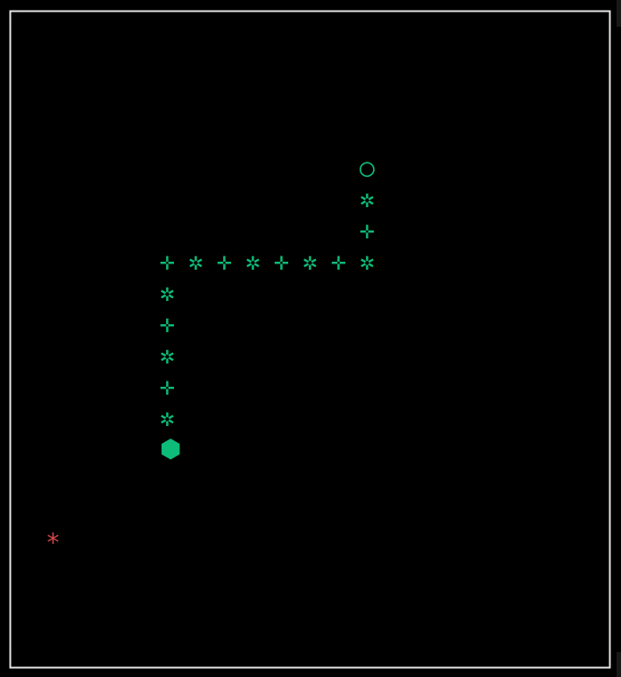

# Nibbler - Devlog - 3

## Table of Contents
1. [Day Four Plan](#41---day-four-plan)
2. [The 3110 Standard](#42---the-3310-standard)
3. [A Game of Spiraling Snakes](#43---a-game-of-spiraling-snakes)

<br>
<br>
<br>

# 4.1 - Day Four Plan
After a couple of days without playing anything, I could finally sit down yesterday and spend some time delivering boxes in *Death Stranding 2*. This is a game with lot's of silent and introspective moments (although, I must say, this second part kind of fills too much of that silence, which was so promiment and welcomed in *DS1*, by compressing the world, shortening routes and, for some reason, putting lots of efforts into making sure that the player is always busy; I don't want to be busy *like that*, I want that full on act-of-being, game-of-existing that was so identitary to the first game back, but alas, videogames gotta videogame I suppose; I'm quite enjoying *DS2*, nevertheless, just maybe not in the way I was expecting to) so I've been mulling over what this *snake* project could look like in the realm of infinite possibility and dreams come true. I feel I'm in a tough, yet extremely familiar spot regarding this endeavor. One the one hand, task's subct wise I'm quite close to being able to turn this in, get my full marks and move on (not in the sense that I can get to that point today, but I can easily have this done by next week). On the other hand, I know I *should* take advantage of this being a game and graphics related project and try to work on it as much as I can, and that's where the mulling takes center stage and I get pumped my just imagining stuff on my way to campus and etc. And right now, I am at that specific rift in between alternatives in which I constantly feel trapped in that old quote from **Top Gun**, feeling that my imagination writes checks that my time, my material conditions and even my abilities struggle to cash. And still, if I don't let myself run freely at crossroads like this, when?

So, today we'll do two main things. On the developing sphere, We'll finish a plain snake game, and on the design spehere, we'll just brainstorm some possibilities, write down some dreams and let tomorrow deal with tomorrow's things. And because dreaming cannot be quite controlled and structured (maybe it can, but what would be the point?), let's list what finishing the game means:
- Food Stuff
	- Spawning
	- Eating
		- Chomping
		- Growing
		- Scoring
- End conditions
	- Hitting a wall vs infinite walls

More than enough time in today's session to do all this (will I come back here and cry because of how wrong I was in my estimations? Stay tuned).

<br>
<br>
<br>

# 4.2 - The 3310 Standard
Let's get into food stuff, plain old dots that make the snake grow. Before tackling it, I think I'll need:
- Some way to store and track food positions
- Colission detection and handling between head and food
- Food spawning.

For the basic build, we can just follow what I recall was the Nokia 3310 *snake* flow: `every time the snake eats, a new food dot appears`.

### New Food Class
I'm moving from the struct based `FoodView` I had up until this moment into a new `Food` class. It's not like a basic, 3310-like *snake* needs it's food to do a lot of things, just to know the position of the food bit and a method to reposition it, but it's a good idea to take everything into a class for a couple of reasons: 
1. I can now just make an instance of food and have the `GameState` point to it, which means the basic game will work with a single food object that will be repositioned every time it gets eaten
2. Plain scalability: if down the line I come up with things that the Food element needs (or some mechanics that can be attached to it), the class approach makes it easier.

```cpp
#pragma once
#include "DataStructs.hpp"

class Food {
	private:
		Vec2	_position;
		int		_hLimit;
		int		_vLimit;

	public:
		Food() = delete;
		Food(Vec2 position, int width, int height);
		
		Food(const Food &other);
		Food &operator=(const Food &other);

		bool replace(Vec2 newPos);

		Vec2 &getPosition();
};
```
```cpp
#include "../incs/Food.hpp"
#include <iostream>

Food::Food(Vec2 position, int width, int height) : _position(position), _hLimit(width), _vLimit(height) {}

Food::Food(const Food &other)
{
	*this = other;
}

Food &Food::operator=(const Food & other)
{
	if (this != &other)
	{
		this->_position = other._position;
	}

	return *this;
}

bool Food::replace(Vec2 newPos)
{
	if ((newPos.x < 0 || newPos.x > _hLimit - 1) ||
		(newPos.y < 0 || newPos.y > _vLimit - 1))
	{
		std::cerr << "Invalid coordinates for food reposition - (" << newPos.x << "," << newPos.y << ")" << std::endl;
		return false;
	}

	_position = newPos;
	return true;
}

Vec2 &Food::getPosition() { return _position; }
```
```cpp
struct GameState {
	int			width;
	int			height;
	Snake		*snake;
	Food		*food;
	bool		gameOver;
};
```
Time for **head-food* collision detection. Easy enough: I'll just change the main object pointerd by `GameManager`, from `Snake` to the whole `GameState`, and use that pointer to access the coordinates of both the head and the food on each manager update. If they are the same, collission detected:
```cpp
void GameManager::checkHeadFoodCollision() {
	Vec2	head = _state->snake->getSegments()[0];
	Vec2	foodPos = _state->food->getPosition();

	if (head.x == foodPos.x && head.y == foodPos.y)
	{
		_state->food->replace(Utils::getRandomVec2(_state->width, _state->height));
	}
		
}
```
Now, let's make the snake grow. Pretty turbo-simple, really. Just add a grow function to `Snake` that adds 1 to it's `_length` attribute and attach a new node to the back with the same coords as the current last one:
```cpp
void Snake::grow() {
	// TODO: take into consideration the limit, or make the limit itself the endgame condition
	_segments[_length] = Vec2{ _segments[_length - 1].x, _segments[_length - 1].y };
	_length++;
}
```
### Intermission: Squared Ncurses and Unicode Support
I've been ignoring something that was irking me from the very beginning: **Ncurses default cell shape is vertically rectangular**. This means that what would be a square window isn `SDL` and `Raylib` looked like a retangular one in `Ncurses`, so I wanted to see if I could fix that. In the process, I found out also a way to make Ncurses support Unicode characters, opening a new level of drawing possibilities for the ASCII realm.

For the square look, my best chance is to just double every cell, so that each character takes two horizontal spaces. It's not a perfect square result, but it's good enough, at least for now. For the Unicode support, some research brought `ncursesw` to my knowledge. By compiling the `.so` with the flag `-lncursesw` and calling `setlocale(LC_ALL, "")` at the top of `init()`, the deal is sealed.

Look at her go:



> I'm starting to think that this initial version of the project, based on multiple libraries, is going to end up being a prototype, if at all. I will trouble myself enough to make the ASCII, `Ncurses` based realm of this version look good and interesting, but an ideal multi-realm/multi-visuals *Nido* would surely be more sanely done in a single, all-capable library or engine that built (or simulated) the different aesthetics.

> Also, **known issue**: Because the singular characters (snake parts, food) are now "doubled" by adding a space to them, when the snake moves immediately to the side of a food piece, it's not drawn. We'll see if I care in regards to this prototype/task turn-in.

<br>

### Endgame Conditions
Let's now make the snake die when it hits a wall or itself. We'll change some things later on, most likely, but for the base standard this will be the way to go. More simple stuff in it's initial implementation, just checking if the head of the snake moves into a wall or into itself, right in the middle of the manager's update, and have a confirmed conlission set the `isRunning` boolean inside `GameState` set to false. Previously, that flag was declared in `Main` itself, but I decided to move into the state struct to have access to it from the manager:
```cpp
void GameManager::update()  {
	_state->snake->move();
	_state->isRunning = checkGameOverCollision();
	checkHeadFoodCollision();
}
```
```cpp
bool GameManager::checkGameOverCollision()
{
	Vec2	head = _state->snake->getSegments()[0];
	if (head.x < 0 || head.x > _state->width - 1)
		return false;

	if (head.y < 0 || head.y > _state->height - 1)
		return false;

	for (int i = 1; i < _state->snake->getLength(); i++)
	{
		if (_state->snake->getSegments()[i].x == head.x && _state->snake->getSegments()[i].y == head.y)
			return false;
	}

	return true;
}
```

And now that we have a snake that can roam the window, eats randomly spawned food and is susceptible to death by collision, the basic snake game is done. I could actually turn this in tomorrow and I'm quite sure (not fully, I must admit) that I could be done with it. But obviously, that is not the mindset. So let's just continue tomorrow. Some things that can kickstart next session:
- `Buffering inputs`
	- Right now quickly pressing direction keys can end up moving the snake back into itself, which should not happen. I think that buffering the inputs should fix this.
- `Refine the food spawning`:
	- Sometimes food is spawned in a snake-occupied cell. The positioning of the spawn should check if the cell is already occupied, and re-reposition as needed.
		- I have to think about what the best way to handle this is. 
			- Is checking for random cells until a free one is found good enough?
			- Should I track occupied/free spaces of the game arena?
			- Might there be some consolidated ways of handling this?
- Start experimenting with the `3D version` (cube-based) in Raylib

<br>
<br>
<br>

# 4.3 - A Game of Spiraling Snakes
Knowing myself, and knowing too that I should try to focus my thought processess better but whatever, I'll just bullet-point-list my way down imagination lane:
- Attempting to make something *new* from something so *old* is difficult. Not that should be the objective, nor it even be present at all during the process, but there's always something alluring in the backdrop of a project like this. Some of my most liked recent games have built precisely on this: think of *Balatro* and poker, *BallxPit* and arcanoid, even Zack Gage's *snak* for the Playdate (which has been on the top of my inspirations since day one, for obvious reasons). I even dabble myself in this when I built my *Pong* engine a couple of projects ago, imposing a layer of new mechanics and dynamics on top of the good old bars and balls. Nothing outstanding, I admit, but a tiny cure for the itch. The fact is that twisting a cassic is complicated, but there's a huge margin for it: *Balatro* and *BallXPit* made a whole ass new game from their source material, but *Snak* is just one of those genius little touches on a bullet-proof structure that's *"simply"* based on finding an angle of possibility, that incredible what-if that lands on the base so well that makes it look like it was always there.
	- In *Snak*, Gage introduces a couple of new dynamics based on adding a height layer over the canonical 2D *snake*. Thanks to this, the snake in *snak* can jump over its own body to avoid itself, as well as hop on and move along itself. Just by this, the movement possibility and feel expands, producing a knot-like aesthetic that changes the whole flow. And alongside that, there's also enemies: food now moves (in fixed ways) and can chomp you back, attaching to the snake's body and thus making it imperative for the player to hop on itself and track-and-munch on the attached enemies.
		- The magic here is that all of this is achieved by following a very simple intuition, as stated by Gage themselves in the Playdate's official *snak* page: ***How much would the game change if I added just one button?***. The snake can now jump, and the rest just follows.
- With the previous points in mind, and while making an honest effort to keep things as controllable as possible inside my brain, two main paths branch in front of me:
	- I could try to keep myself in a similar way as what *snak* does, find my place to land, try to just design something small but significant.
	- I could go big and just try to make a whole ass new game on top of the classic snake's mechanics.
- It's not that this is an easy decision to make. The first way, attempting to follow suit of *snak* and pretend that I can build something in the likes of one of the most interesting game designers in today's videogame landscape could come up as delulu, albeit it is a very exciting premise. The second route, building a new game from *snake* is equally ludicrous because 1) it feeds the mind-chaos-beast, producing a never-ending flood of what-ifs, 2) it would take a lot of time and resources for what would be a solo development for someone (me) that is right now looking for an entry level developing job (if you're reading this and have `1` `(one)` unit of available job, please call me), and 3) it would also mean that instead of looking for my tiny mechanical angle in the *snake* institution I would have to build an array of stuff that could be argued is, well, *more*.
	- So I guess the sane mind would focus on the first option, simply take this opportunity as a somewhat challenge to twist *snake* while keeping it inside it's boundaries, but there's something else floating over this rant, a particularly chaos-prone one, that also relates to the project's inception: **the aesthetics switching**. Ruminating on this is really what awakened the chaos-mind-demon (and I guess that doing it while listening to White Chapel's *Hymns in Dissonance* also played a part; *father, we've come to devour the eyes of god*), but the main idea here is that tying different visualizations to different game states or levels is kind of juicy. The counterpoint to this is that, if I think about it, the combination of *snake* and *changing visuals* is a pure contingency, something after the fact that there's a subject for a task demanding it. The changing visuals are the point, the game is just the background tool to test it. Is this a problem? I guess not. Am I just thinking about twisting snakes just because of some coincidence? I guess yes. Should it matter? I guess I don't know.
		- The fact of the matter is that *I am currently building a snake game that changes visuals*, so it is what it is and any ounce more of thought in this direction would be wasted. And another fact of the matter is that I need to build something portfolio-worthy, and *snake* is a perfect canvas; blessed are thy consequences, is my last guess, so I'll just let myself go from the next point on. Let's make an idea dumpster.

<br>

- One main thought: **`let's make a game with different types of snake heads`** and **`different arenas`** and call it ***`Nido`***.
- The game could be navigated with the classic *snake* control scheme, maybe also building on top of Gage's jumping version.
- The snake could have some type of `"limited health"`: starting from Head + 3 segments, upper limit of head + 9 segments, lower limit of hed + 1 segment.
- The snake could pick up `special segments` with different effects. For example:
	- A bomb segment would explode upon the head crashing into it, making a explosion that could be used to modify the space or attack some sort of enemy (a boss?)
	- *more coming soon*
- The snake could have an array of different heads to choose before starting a game/run.
	- The heads could be collected by playing, maybe tied to some encounters, some puzzles, some score conditions, ...
	- The heads could be specifically tied to how the snake moves, for example:
		- *coming soon*
- The overall progression of the game could be tied to changing aesthetics
	- The whole game could be built around an aesthetically expressed ascension, `from ASCII to some 3D realm`, all while `tying each realm's aesthetic to how the game is played in them`, in the sense that it would be somewhat different to play the basic, ASCII plane of `nido` and one of it's 3D tiers.
		- This, obviously, means that *each realm would require a slight re-design of the *snake* base*, but at this point everything stands, the only worthy dreams are those that feel deranged.
			- But it could also be tied to that `one-extra-button` approach of Gage, making that extra button do different things depending on the realm. I'm thinking:
				- In some 2D world, jump
				- In some 3D world, dig (as the world would be, let's say, an apple-like cube and the snake would become worm, looking for something)
				- *more coming soon*

- Enemies? Maybe.
- Knowledge based progression? Maybe. (Think here of *Void Stranger* or *Tunic*, won't say *Outer Wilds* because that would definately be one notch too delulu).
- Random ideas:
	- `PUZZLE`: Now that the ASCII realm can handle Unicode characters, I could embed a message in the snake by using some type of encoding (morse, etc). If a player achieves a specific growth, the whole body would spell something, a key to unlock the next realm or whatever.