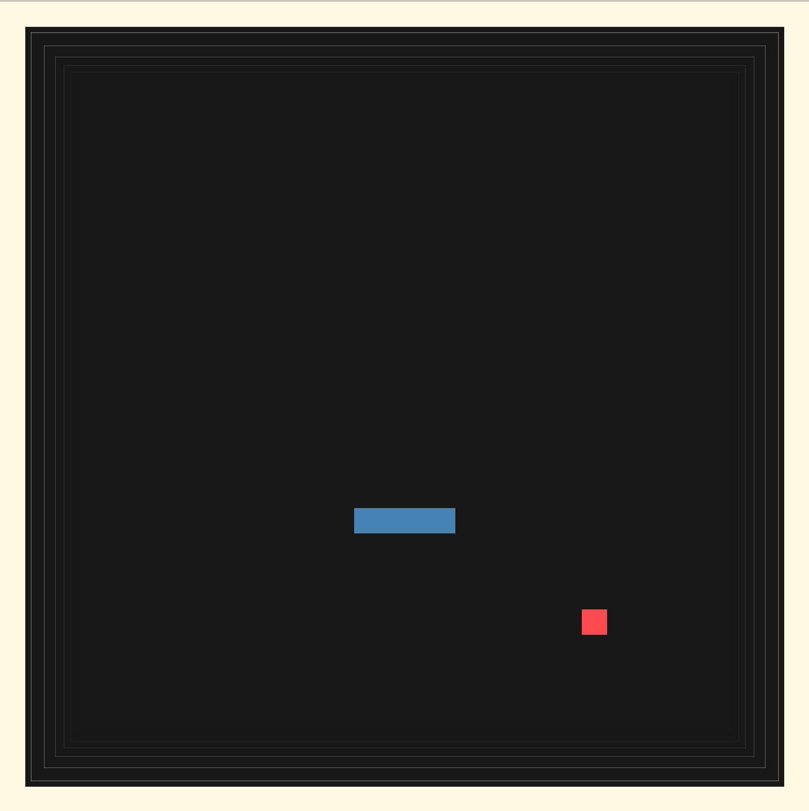

# Nibbler - Devlog - 7

## Table of Contents
1. [Day Seven Plan](#71-day-seven-plan)
2. [2D Graphics Are Difficult](#72-2d-graphics-are-difficult)
	- [Tunnel Border](#tunnel-border)
	- [Particle Effects](#particle-effects)

<br>
<br>
<br>

## 7.1 Day Seven Plan
I'm quite happy with the visuals reached today regarding the 3D realm. They're basic but look good, and I think they're more than enough for the task's requiremets. The problem at this point is that the other two realms, ASCII and 2D are quite behind in regards to a e s t h e t i c s, so I guess that's going to be the main focus of today's work. I'd really like to have this project fully done by the end of this week, so achieving an overall satisfactory visual level across libraries would be really helpful towards that goal. Then I'll be able to focus in entry and exit points and use whatever time I have left to add some extra gameplay sprinkles.

> Also, I've been increasingly obsessed about trying to take my shadow pupettering game prototype into Playdate, so I want to dedicate some time to it. And there is a ton of other things in my table, so the sooner I can reach a milestone with this snake, the better.

Anyways, day seven's general plan is:
- Enhance ASCII realm's visuals
- Enhance 2D realm's visuals
- If time:
	- Score tracking
	- Exit point expansion: game over popup, retry option, exit option, score visualization


> *Oops, I got sidetracked with a Playdate prototype I'm also going to build this days haha let's get back to this*

## 7.2 2D Graphics Are Difficult
Making a good looking 2D, flat version of snake is, contrary of what it may look like, quite complicated. Buildin a 3D setup with a couple o color choices and some postprocessing returns an easy good looking, geometrical visualization, but in 2D there are less tools. Or, at least, there are less tools that give a quick, general, satisfactory render.

My best route right now is to replicate something similar to what I did in my [*Pong* engine](https://github.com/hugomgris/pong), i.e., implement some particles and and line-based, depth-faking effects. The only problem is that back in the day, arriving to that aesthetic took me a couple of months (as always, I had to learn my tools before using them), so I'll have to make a quicker version and don't die in the process.

### Tunnel Border
First, let's make a border around the game arena with a tunnel like effect, aiming for it to look as if the game plane was moving towards the inside of the screen along an infinite tunnel. I did a similar effect for the *Pong* walls back in the day, so I already know what this entrails. The `SDLGraphic` class will need:
- A way to differentiate between the inner area inside the new border walls (i.e., the game arena itself)
- A border offset value
- A `BorderLine` class, a simple rectangle drawing based on the window's size and proportions, with attributes to track it's animation `progress` and time `age`, the latter to know when to destroy every iteration.
- Animation related attributes:
	- `SpawnInterval`
	- `AnimationSpeed`
	- A boolean toggler for the effect
- An update function for the effect
- A rendering function for the effect
- An easing util function to add some acceleration flair to the effect

The new `SDLGraphic` class looks like this:
```cpp
struct BorderLine {
	float progress;        // 0 = at arena, 1 = at window edge
	float age;
	
	BorderLine() : progress(0.0f), age(0.0f) {}
};

class SDLGraphic : public IGraphic {
private:
	SDL_Window		*window;
	SDL_Renderer	*renderer;
	int				gridWidth;
	int				gridHeight;
	int				cellSize;
	int				borderOffset;

	// Tunnel effect animation
	std::vector<BorderLine> borderLines;
	std::chrono::high_resolution_clock::time_point lastSpawnTime;
	float spawnInterval;
	float animationSpeed;
	bool enableTunnelEffect;

	// Colors
	SDL_Color customWhite = { 255, 248, 227, 255};	// Off-white
	SDL_Color customBlack = { 23, 23, 23, 255};		// Charcoal black

	SDL_Color lightRed = { 254, 74, 81, 255 };
	//SDL_Color darkRed = { 180, 52, 58, 255 };

	SDL_Color lightBlue = { 70, 130, 180, 255 };
	//SDL_Color darkBlue = { 18, 45, 68, 255 };
	
	// Helper function to set render color from SDL_Color
	void setRenderColor(SDL_Color color, bool customAlpha = false, Uint8 alphaValue = 255);
	
	// Tunnel effect helper functions
	void updateTunnelEffect(float deltaTime);
	void renderTunnelEffect();
	float easeInQuad(float t);
	
public:
	SDLGraphic();
	SDLGraphic(const SDLGraphic&) = delete;
	SDLGraphic &operator=(const SDLGraphic&) = delete;
	~SDLGraphic();
	
	void init(int width, int height) override;
	void render(const GameState& state) override;
	Input pollInput() override;

	// Drawing functions
	void drawBorder(int thickness);
};

extern "C" IGraphic* createGraphic() {
	return new SDLGraphic();
}

extern "C" void destroyGraphic(IGraphic* g) {
	delete g;
}
```
The class's constructor definition will set up the animation attribute's values, and the spawning times will be managed through `chrono`. Then, at the top of the `render` function, `delta time` will need to be calculated for the animation pipeline. I guess *I could use the delta time calculation in the game logic loop** and send it as an attribute to `render()`, but for now I'll make another calculation and I'll see if this refactoring is trully possible. After that, the whole tunnel effect is based in the beforementioned `update` and `render` functions relative to the effect.
```cpp
void SDLGraphic::updateTunnelEffect(float deltaTime) {
	if (!enableTunnelEffect) return;

	// Update existing border lines
	for (auto& line : borderLines) {
		line.age += deltaTime * animationSpeed;
		line.progress = easeInQuad(line.age);  // Apply easing for acceleration
	}

	// Remove lines that have completed their animation (progress >= 1.0)
	borderLines.erase(
		std::remove_if(borderLines.begin(), borderLines.end(),
			[](const BorderLine& line) { return line.progress >= 1.0f; }),
		borderLines.end()
	);

	// Spawn new lines based on spawn interval
	auto now = std::chrono::high_resolution_clock::now();
	std::chrono::duration<float> elapsed = now - lastSpawnTime;
	
	if (elapsed.count() >= spawnInterval) {
		borderLines.push_back(BorderLine());
		lastSpawnTime = now;
	}
}
```
- Update on the effect is managed based on the value of delta time, which is added to a given line's `age` (times `animationSpeed`).
- `progress` is eased in based on the age value, with a simple calculation based on squaring said float, as it will be growing from 0.0f to 1.0f.
- Destruction of `borderLines` is done via an **erase-remove** pattern, which is based in a condition (in our case, if `progress >= 1.0f`):
	- It goes through `std::remove_if()` (from `<algorithm>`):
		- ```std::remove_if(borderLines.begin(), borderLines.end(), [](const BorderLine& line) { return line.progress >= 1.0f; })```
		- It iterates through the `borderLine` vector-based collection and calls the sent lambda on each element, rearranging the elements to put the marked-for-erased ones at the end of the container, returning an iterator to the first entry that needs to be erased.
		- Via `erase`, a `vector` class function, the pointed elements gets removed from the collection.

> I think that in c++20 I can use `std::erase_if()` but this works for now

- Swapning of `borderLines` is time based, a simple comparison based on the `spawnInterval` and a push_back of a new `borderLine` into the vector when needed

<br>

```cpp
void SDLGraphic::renderTunnelEffect() {
	if (!enableTunnelEffect || borderLines.empty()) return;

	SDL_SetRenderDrawBlendMode(renderer, SDL_BLENDMODE_BLEND);

	// Start offset: 2 cells inward from arena edge
	int startOffset = -2 * cellSize;
	// End offset: at the inner edge of the border (borderOffset - cellSize for the border thickness)
	int endOffset = 0;
	// Total travel distance
	int travelDistance = endOffset - startOffset;

	for (const auto& line : borderLines) {
		// Calculate current offset from arena edge (starts at -2*cellSize, ends at 0)
		int currentOffset = startOffset + static_cast<int>(line.progress * travelDistance);
		
		// Calculate alpha (0 -> 255)
		Uint8 alpha = static_cast<Uint8>(line.progress * 150);
		
		// Line width stays constant at 1px
		int lineWidth = 1;

		// Calculate the rectangle positions
		// Arena starts at borderOffset, has dimensions gridWidth*cellSize x gridHeight*cellSize
		int arenaX = borderOffset;
		int arenaY = borderOffset;
		int arenaW = gridWidth * cellSize;
		int arenaH = gridHeight * cellSize;

		// Draw the four border rectangles expanding outward
		setRenderColor(customWhite, true, alpha);

		// Top border
		SDL_Rect top = {
			arenaX - currentOffset,
			arenaY - currentOffset,
			arenaW + (2 * currentOffset),
			lineWidth
		};

		// Bottom border
		SDL_Rect bottom = {
			arenaX - currentOffset,
			arenaY + arenaH + currentOffset - lineWidth,
			arenaW + (2 * currentOffset),
			lineWidth
		};

		// Left border
		SDL_Rect left = {
			arenaX - currentOffset,
			arenaY - currentOffset,
			lineWidth,
			arenaH + (2 * currentOffset)
		};

		// Right border
		SDL_Rect right = {
			arenaX + arenaW + currentOffset - lineWidth,
			arenaY - currentOffset,
			lineWidth,
			arenaH + (2 * currentOffset)
		};

		SDL_RenderFillRect(renderer, &top);
		SDL_RenderFillRect(renderer, &bottom);
		SDL_RenderFillRect(renderer, &left);
		SDL_RenderFillRect(renderer, &right);
	}

	SDL_SetRenderDrawBlendMode(renderer, SDL_BLENDMODE_NONE);
}
```
- Because `SDL2` doesn't allow me to tweak the thickness of the lines used to draw a primitive (in the border case, a rectangle), I have to split every rectangle into 4 filled rectangles. This is annoying on itself, but also because the overlapping of the corners can look *bad*, showing the superposition and, thus, the "trick". I think that in the current implementation that undesired visual behavior is barely noticeable, though, so I'll leave it be.
- `offset` and `alpha` are `progress` based
- `width` is for now fixed, as having it also be progressively bigger and progress based was found (by me) a little bit dizzying (I almost puked).
- The four rectangles are drawn based on the offset values, which place them progressively in an eased spot between the initial spawning position (`2 * cellSize` inwards) and the erasing position (inner edges of fixed outer border).

<br>

> It looks like this (it's cooler when you see it moving):


<br>

### Particle Effects
