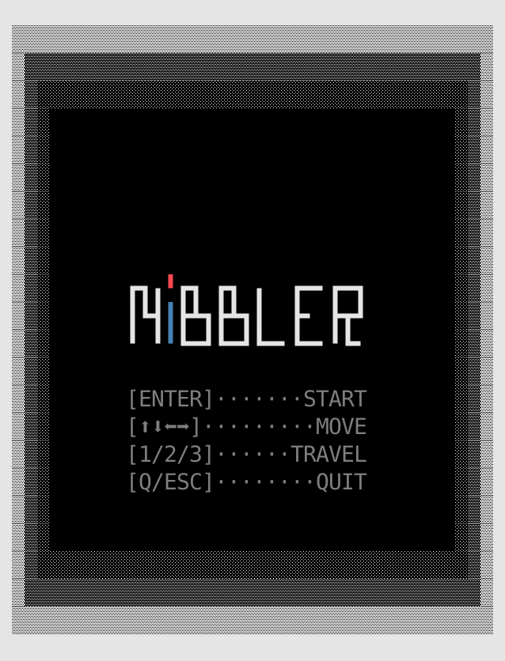
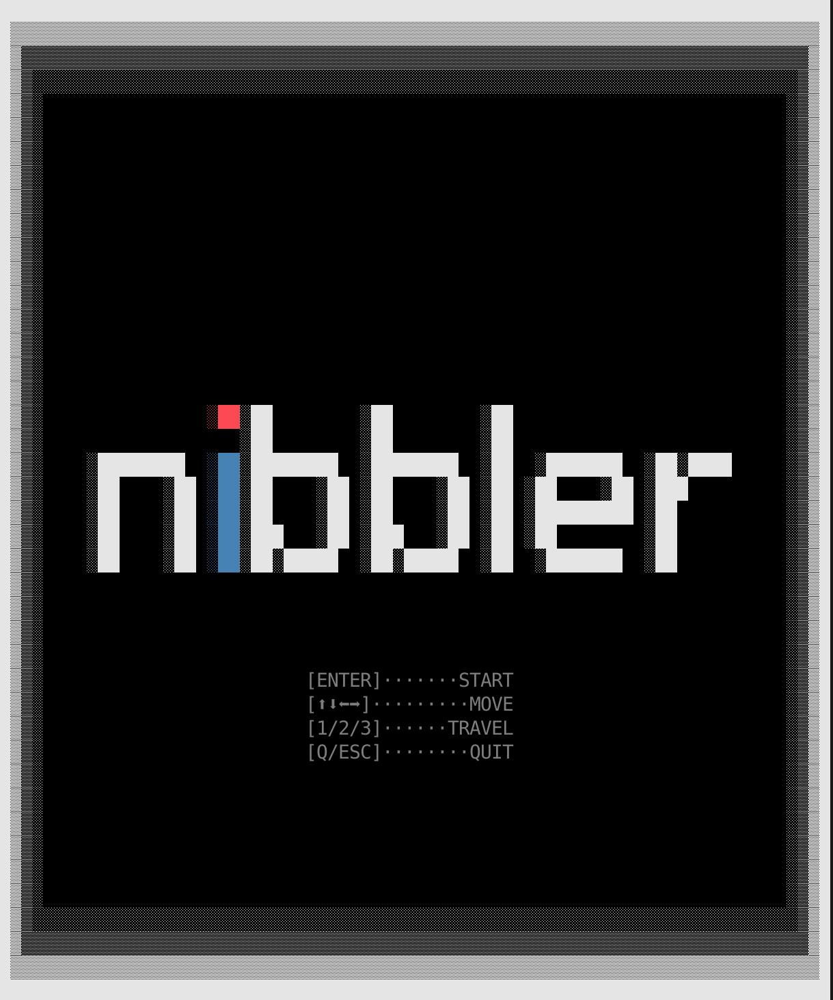

# Nibbler - Devlog - 10

## Table of Contents
1. [Day Ten Plan](#101-day-ten-plan)
2. [Small Leaks and Great Ships](#102-small-leaks-and-great-ships)
3. [Ncurses Keeps Cursing Me](#103-ncurses-keeps-cursing-me)

<br>
<br>
<br>

## 10.1 Day Ten Plan
It has been a couple of days since the last time I worked in this. The project is quite done, but there's still some things that *need* to be done, as well as a bunch of others that *could* be done. I'll obviously tackle first the necessities in this tenth session, and once I feel that those are done I'll think about the potentialities. So, today's checklist contains:
- Leak check (and cleanup)
- Subject thorough revision
- Start and Gameover screen refinements

Once these are done, I'll have to merge my branch with my partern's, who's been taking care of sounds. And then we'll see.

<br>
<br>
<br>

## 10.2 Small Leaks and Great Ships
I just googled "quotes with leaks" and something apparently said by Benjamin Franklin popped up. Even great ships sink under small leaks or something in that vein. And while I don't know (you tell me, be nice) if this is a Great Ship, I know it has some Small Leaks, so we have to put ourselves in the mind of the hunter. Seek and retrieve every ounce of lost memory, bring them home, make the project gr... Oops, I almost got too carried away. Scratch that. Forget about it. Let's just work.

I've been doing some tests and it *looks like* all the leak logs were related to the graphic libraries, specifically how the track their internal and global states. Setting up some suppresion files for valgrind, all related to internal library functions, results in a report of 0 leaked units of memory, so I guess I'm good? Let me double check...

...yeah, my general conclussion is that all the traces thrown by Valgrind are related to **library-internal states** (specially from `SDL2`). This is happening, to the best of my understanding, because the core concept of the project, **dynamically linking the chosen graphic libraries** is something for which said libraries are not really designed. Unloading and loading them leaves some global states behind during a unique execution that inevitably get flagged by the leak checkers, and there's nothing I can do about it. (If there is, I'm not aware of it; if you are reading this and have some tips, they're always welcome).

So, the best thing to do right now is to set up leak check pipelines with **valgrind suppresion files** that can be used to prove, upon discussion, that *our* program is leak free, and that every other consideration should be done regarding the libraries and the project's concept. To this end, a new `checks/` directory has been added to the project, containing check scripts and the `.supp` files for Valgrind. Running `nibbler` through the scripts should be enough for anyone assessing the work.

There is a total of **4 scripts** with corresponding `.supp` files:
- `check_leaks_ncurses.sh`
- `check_leaks_sdl.sh`
- `check_leaks_raylib.sh`
- `check_leaks_unified.sh`

This shall be enough.

```bash
#!/bin/bash
# Unified leak checker for all graphics libraries
# Uses combined suppressions (all_libs.supp) to check any library

echo "Unified Leak Checker - All Libraries"
echo "========================================"
echo ""

# Build the project
echo "Building project..."
make -s
if [ $? -ne 0 ]; then
    echo "Build failed"
    exit 1
fi

echo "Build successful"
echo ""
echo "Running Valgrind with unified suppressions..."
echo ""

# Run Valgrind with combined suppressions
make && valgrind \
    --leak-check=full \
    --show-leak-kinds=definite,indirect \
    --track-origins=yes \
    --verbose \
    --log-file=checks/valgrind-unified.txt \
    --suppressions=checks/all_libs.supp \
    ./nibbler 30 30

echo ""
echo "Unified Leak Check Results:"
echo "=============================="
echo ""

# Check for leaks in user code
USER_LEAKS=$(grep -E "SDLGraphic|NCursesGraphic|RaylibGraphic|main\.cpp|Snake|Food|GameManager|LibraryManager" checks/valgrind-unified.txt | grep -E "definitely lost|indirectly lost")

if [ -z "$USER_LEAKS" ]; then
    echo "No leaks detected!"
    echo ""
    echo "Summary from checks/valgrind-unified.txt:"
    grep "definitely lost" checks/valgrind-unified.txt | head -1
    grep "indirectly lost" checks/valgrind-unified.txt | head -1
    grep "suppressed" checks/valgrind-unified.txt | tail -1
else
    echo "Leaks found in user code:"
    echo "$USER_LEAKS"
fi

echo ""
echo "Full output saved to: valgrind-unified.txt"
echo ""
echo "Tip: Use library-specific checkers for detailed analysis:"
echo "   ./check_leaks_ncurses.sh	# NCurses only"
echo "   ./check_leaks_sdl.sh		# SDL2 only"
echo "   ./check_leaks_raylib.sh	# Raylib only"
 ```
<br>
<br>
<br>

## 10.3 Ncurses Keeps Cursing Me
I started reworking the menus, which has to be done for all 3 libraries. And I started it by tackling Ncurses, which, `oh surprise`, was hell. Well, it wasn't *that* bad to be honest, but because I wanted to spend some time making some minimally fancy logos for the start screen and most of the drawing in `Ncurses` needs to be handled quite manually... Just making the new start menu ate the rest of my working day. Specially because I wanted to have nice looking start screens for two cases: **big and small launching windows**. This meant that I had to split the start menu rendering into two pipelines, based on the window's width at initiation. Then, because I wanted to play around with the colors in the logo, I had to split the drawing itself in several layers (4 for each logo). I ended up having logo text files for each layer (A, B, C, D) and two versions, `_small` and `large`. Some coding here and there, a lot of fine tuning and adjustments, some (n)cursing while clenching the fist, and we have **new `Ncurses` start screens!**




<br>

>And my time for today is done! NOOOO!!!
>
>Well, tomorrow I'll work on the gameover screens for Ncurses and then I'll move on to redesigning the screens for SDL and RAYLIB. 